# Interface version 3 6
> **Source:** `Interface_version_3_6.pdf`
> **Generated:** 2026-01-12 15:23:58
---

<h2>Table of Contents</h2>

<table class="toc-table">
  <tr><td class="toc-left toc-indent-0"><a href="#1-intended-use">1 Intended use</a></td><td class="toc-right">1</td></tr>
  <tr><td class="toc-left toc-indent-0"><a href="#2-general">2 General</a></td><td class="toc-right">4</td></tr>
  <tr><td class="toc-left toc-indent-1"><a href="#2.1-file-structure">2.1 File structure</a></td><td class="toc-right">5</td></tr>
  <tr><td class="toc-left toc-indent-1"><a href="#2.2-general-syntaxvalue-ranges">2.2 General syntax/value ranges</a></td><td class="toc-right">6</td></tr>
  <tr><td class="toc-left toc-indent-1"><a href="#2.3-coordinate-systems">2.3 Coordinate systems</a></td><td class="toc-right">7</td></tr>
  <tr><td class="toc-left toc-indent-2"><a href="#2.3.1-element-coordinate-system">2.3.1 Element coordinate system</a></td><td class="toc-right">8</td></tr>
  <tr><td class="toc-left toc-indent-2"><a href="#2.3.2-component-coordinate-system">2.3.2 Component coordinate system</a></td><td class="toc-right">9</td></tr>
  <tr><td class="toc-left toc-indent-2"><a href="#2.3.3-reference-planes">2.3.3 Reference planes</a></td><td class="toc-right">10</td></tr>
  <tr><td class="toc-left toc-indent-2"><a href="#2.3.4-reference-edges">2.3.4 Reference edges</a></td><td class="toc-right">11</td></tr>
  <tr><td class="toc-left toc-indent-2"><a href="#2.3.5-plane-coordinate-system">2.3.5 Plane coordinate system</a></td><td class="toc-right">12</td></tr>
  <tr><td class="toc-left toc-indent-2"><a href="#2.3.6-spatial-processing-coordinate-system">2.3.6 Spatial processing coordinate system</a></td><td class="toc-right">13</td></tr>
  <tr><td class="toc-left toc-indent-1"><a href="#2.4-processing-the-file">2.4 Processing the file</a></td><td class="toc-right">15</td></tr>
  <tr><td class="toc-left toc-indent-0"><a href="#3-change-history">3 Change history</a></td><td class="toc-right">16</td></tr>
  <tr><td class="toc-left toc-indent-1"><a href="#3.1-changes-from-interface-version-1.x">3.1 Changes from interface version 1.x</a></td><td class="toc-right">16</td></tr>
  <tr><td class="toc-left toc-indent-1"><a href="#3.2-changes-for-interface-version-2.x">3.2 Changes for interface version 2.x</a></td><td class="toc-right">17</td></tr>
  <tr><td class="toc-left toc-indent-1"><a href="#3.3-changes-for-interface-version-3.x">3.3 Changes for interface version 3.x</a></td><td class="toc-right">18</td></tr>
  <tr><td class="toc-left toc-indent-2"><a href="#3.3.1-interface-version-3.0">3.3.1 Interface version 3.0</a></td><td class="toc-right">18</td></tr>
  <tr><td class="toc-left toc-indent-2"><a href="#3.3.2-interface-version-3.1">3.3.2 Interface version 3.1</a></td><td class="toc-right">19</td></tr>
  <tr><td class="toc-left toc-indent-2"><a href="#3.3.3-interface-version-3.2">3.3.3 Interface version 3.2</a></td><td class="toc-right">20</td></tr>
  <tr><td class="toc-left toc-indent-2"><a href="#3.3.4-interface-version-3.3">3.3.4 Interface version 3.3</a></td><td class="toc-right">21</td></tr>
  <tr><td class="toc-left toc-indent-2"><a href="#3.3.5-interface-version-3.4">3.3.5 Interface version 3.4</a></td><td class="toc-right">22</td></tr>
  <tr><td class="toc-left toc-indent-2"><a href="#3.3.6-interface-version-3.6">3.3.6 Interface version 3.6</a></td><td class="toc-right">23</td></tr>
  <tr><td class="toc-left toc-indent-0"><a href="#4-syntax">4 Syntax</a></td><td class="toc-right">24</td></tr>
  <tr><td class="toc-left toc-indent-1"><a href="#4.1-file-header">4.1 File header</a></td><td class="toc-right">24</td></tr>
  <tr><td class="toc-left toc-indent-1"><a href="#4.2-components">4.2 Components</a></td><td class="toc-right">26</td></tr>
  <tr><td class="toc-left toc-indent-2"><a href="#4.2.1-single-components-single-bars">4.2.1 Single components, single bars</a></td><td class="toc-right">26</td></tr>
  <tr><td class="toc-left toc-indent-2"><a href="#4.2.2-panels-and-shuttering">4.2.2 Panels and shuttering</a></td><td class="toc-right">30</td></tr>
  <tr><td class="toc-left toc-indent-2"><a href="#4.2.3-unprocessed-parts">4.2.3 Unprocessed parts</a></td><td class="toc-right">32</td></tr>
  <tr><td class="toc-left toc-indent-2"><a href="#4.2.4-modules">4.2.4 Modules</a></td><td class="toc-right">33</td></tr>
  <tr><td class="toc-left toc-indent-1"><a href="#4.3-spatial-processing-plane">4.3 Spatial processing plane</a></td><td class="toc-right">34</td></tr>
  <tr><td class="toc-left toc-indent-1"><a href="#4.4-operations">4.4 Operations</a></td><td class="toc-right">36</td></tr>
  <tr><td class="toc-left toc-indent-2"><a href="#4.4.1-component-processing-steps">4.4.1 Component processing steps</a></td><td class="toc-right">36</td></tr>
  <tr><td class="toc-left toc-indent-2"><a href="#4.4.2-panel-processing-steps-shuttering-processing">4.4.2 Panel processing steps, shuttering processing</a></td><td class="toc-right">40</td></tr>
  <tr><td class="toc-left toc-indent-2"><a href="#4.4.3-units">4.4.3 Units</a></td><td class="toc-right">42</td></tr>
  <tr><td class="toc-left toc-indent-2"><a href="#4.4.4-external-nc-programs">4.4.4 External NC programs</a></td><td class="toc-right">43</td></tr>
  <tr><td class="toc-left toc-indent-2"><a href="#4.4.5-assignment-of-signs-for-trimming-and-drilling">4.4.5 Assignment of signs for trimming and drilling</a></td><td class="toc-right">44</td></tr>
  <tr><td class="toc-left toc-indent-1"><a href="#4.5-attributes-properties">4.5 Attributes, properties</a></td><td class="toc-right">45</td></tr>
  <tr><td class="toc-left toc-indent-1"><a href="#4.6-polygon-paths">4.6 Polygon paths</a></td><td class="toc-right">46</td></tr>
  <tr><td class="toc-left toc-indent-0"><a href="#5-material-index-installation-position">5 Material index, installation position</a></td><td class="toc-right">48</td></tr>
  <tr><td class="toc-left toc-indent-1"><a href="#5.1-installation-position-of-ug-og-ls-qs-ebt">5.1 Installation position of UG, OG, LS, QS, EBT</a></td><td class="toc-right">48</td></tr>
  <tr><td class="toc-left toc-indent-1"><a href="#5.2-material-indices-for-components">5.2 Material indices for components</a></td><td class="toc-right">49</td></tr>
  <tr><td class="toc-left toc-indent-1"><a href="#5.3-material-indices-for-panels-and-shuttering">5.3 Material indices for panels and shuttering</a></td><td class="toc-right">50</td></tr>
  <tr><td class="toc-left toc-indent-0"><a href="#6-control-codes-for-processing-steps">6 Control codes for processing steps</a></td><td class="toc-right">51</td></tr>
  <tr><td class="toc-left toc-indent-1"><a href="#6.1-sawing-and-polygon-trimming">6.1 Sawing and polygon trimming</a></td><td class="toc-right">51</td></tr>
  <tr><td class="toc-left toc-indent-2"><a href="#6.1.1-tool-category">6.1.1 Tool category</a></td><td class="toc-right">52</td></tr>
  <tr><td class="toc-left toc-indent-2"><a href="#6.1.2-undercut-and-overcut">6.1.2 Undercut and overcut</a></td><td class="toc-right">53</td></tr>
  <tr><td class="toc-left toc-indent-2"><a href="#6.1.3-tool-radius-correction">6.1.3 Tool radius correction</a></td><td class="toc-right">54</td></tr>
  <tr><td class="toc-left toc-indent-2"><a href="#6.1.4-synchronous-and-reverse-rotation">6.1.4 Synchronous and reverse rotation</a></td><td class="toc-right">56</td></tr>
  <tr><td class="toc-left toc-indent-2"><a href="#6.1.5-examples">6.1.5 Examples</a></td><td class="toc-right">57</td></tr>
  <tr><td class="toc-left toc-indent-1"><a href="#6.2-pocket-trimming">6.2 Pocket trimming</a></td><td class="toc-right">58</td></tr>
  <tr><td class="toc-left toc-indent-1"><a href="#6.3-highlight">6.3 Highlight</a></td><td class="toc-right">59</td></tr>
  <tr><td class="toc-left toc-indent-1"><a href="#6.4-application-line">6.4 Application line</a></td><td class="toc-right">60</td></tr>
  <tr><td class="toc-left toc-indent-1"><a href="#6.5-polygon-bocked-surfaces">6.5 Polygon bocked surfaces</a></td><td class="toc-right">61</td></tr>
  <tr><td class="toc-left toc-indent-0"><a href="#7-angles-and-radii">7 Angles and radii</a></td><td class="toc-right">62</td></tr>
  <tr><td class="toc-left toc-indent-1"><a href="#7.1-rotation-and-tilt-angle-of-spatial-processing-plane-rbe2">7.1 Rotation and tilt angle of spatial processing plane RBE2</a></td><td class="toc-right">62</td></tr>
  <tr><td class="toc-left toc-indent-1"><a href="#7.2-rotation-tilt-and-gradient-angle-of-the-saw-cut-sg">7.2 Rotation, tilt, and gradient angle of the saw cut SG</a></td><td class="toc-right">63</td></tr>
  <tr><td class="toc-left toc-indent-2"><a href="#7.2.1-saw-cut-without-gradient-angle">7.2.1 Saw cut without gradient angle</a></td><td class="toc-right">64</td></tr>
  <tr><td class="toc-left toc-indent-2"><a href="#7.2.2-saw-cut-with-gradient-angle">7.2.2 Saw cut with gradient angle</a></td><td class="toc-right">65</td></tr>
  <tr><td class="toc-left toc-indent-1"><a href="#7.3-tilt-angle-for-polygon-points-pp-kb-and-mp">7.3 Tilt angle for polygon points PP, KB, and MP</a></td><td class="toc-right">66</td></tr>
  <tr><td class="toc-left toc-indent-1"><a href="#7.4-radius-for-polygon-point-mp">7.4 Radius for polygon point MP</a></td><td class="toc-right">67</td></tr>
  <tr><td class="toc-left toc-indent-0"><a href="#8-examples">8 Examples</a></td><td class="toc-right">68</td></tr>
  <tr><td class="toc-left toc-indent-1"><a href="#8.1-example-file-header">8.1 Example file header</a></td><td class="toc-right">68</td></tr>
  <tr><td class="toc-left toc-indent-1"><a href="#8.2-example-components">8.2 Example: components</a></td><td class="toc-right">69</td></tr>
  <tr><td class="toc-left toc-indent-1"><a href="#8.3-example-of-panels">8.3 Example of panels</a></td><td class="toc-right">70</td></tr>
  <tr><td class="toc-left toc-indent-1"><a href="#8.4-example-slats-and-contra-slats">8.4 Example slats and contra slats</a></td><td class="toc-right">71</td></tr>
  <tr><td class="toc-left toc-indent-1"><a href="#8.5-polygon-paths">8.5 Polygon paths</a></td><td class="toc-right">72</td></tr>
</table>

<h2 id="1-intended-use">1 Intended use</h2>

Interface description for prefabricated house elements

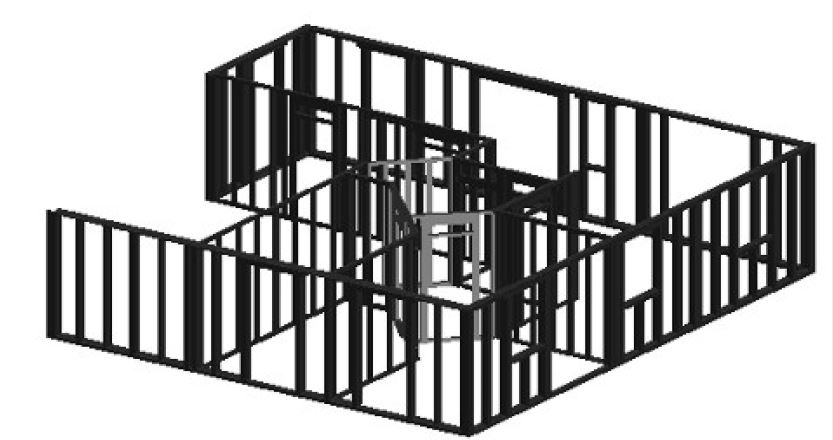

The party responsible for the development and maintenance of this interface is:

WEINMANN Holzbausytemtechnik GmbH, Forchenstr. 50, 72813 St. Johann, Germany

Interface version 3.6

As at: 01/16/2025

The right to make changes is reserved.

---

<h2 id="2-general">2 General</h2>

This document describes the structure of an element of a prefabricated house.

With one exception, the document does not contain any specific definitions for specific machines.

WEINMANN recommends using the file extension "wup".

---

<h3 id="2.1-file-structure">2.1 File structure</h3>

The file must be available in MS-DOS text format. Line break: CR/LF (# 0D0A).

Permissible codings are: ASCII and UTF-16 (BMP, LITTLE ENDIAN).

- File header: VERSION, ANR, ELB, ELN, ZNR, REIHE, ELA, ELM, WNP, CAD, CADRE- LEASE
	- Optional: definition of unprocessed parts: RT
		- (A) Definition of components of the frame work, introduced by the definition of a component: UG, OG, LS, QS, BT4, BT6, EBT, BTn
			- Attributes of a component: PROPERTY
			- Component processing steps: UNIT, SG, PSG, TA, KN, MPL, PAF, PZF, PSF, SZ
			- Spatial processing plane RBE/RBE2, followed by component processing steps
		- (B) Definition of component positions, introduced by the definition of layered components of the same type: PLI0...PLI10, PLA0...PLA10, SLI1...SLI10, SLA0...SLA10
			- Layer processing steps: UNIT, PSG, PAF, PSF, NR, NBR, PSZ, PML, PAL, KN
			- Spatial processing plane RBE/RBE2, followed by the corresponding processing steps
		- (C) Definition of modules: MODUL, ENDMODUL
			- Definition of the component positions (B) or components of the frame work (A)

Multiple specifications of definitions of the categories (A), (B), or (C) are possible.

The definition of a category is completed by the definition of a new category.

---

<h3 id="2.2-general-syntaxvalue-ranges">2.2 General syntax/value ranges</h3>

- Maximum line length: 250 characters
- Spaces and tabs are permissible between keywords and/or parameters
- Any line can be designed as a "comment" line. It begins with the keyword "TXT"
- Each definition of a header date, a component, a processing step, or a comment ends with the limiter ";". Characters behind this are comments.
- Parameter range for integers, unless specified otherwise: -32768 ... +32767
- Parameter range for floating point numbers, unless specified otherwise: +- 3.402 * 1038. Max. three decimal points separated by a point, up to +/- 10000000 not specified exponentially. Floating point numbers are used for lines, radii, angles, and coordinates
- Positions and dimensions are specified in mm
- Angles are specified in degrees
- Within full version numbers, such as 3.0–3.9, the keywords remain constant
- In this document, optional parameters are specified in square brackets (e.g. [Z]). Standard settings are specified in curly brackets (e.g. {0})
- "*" behind a parameter indicates any frequent reproducibility of the parameter
- Explicitly named data types are listed in brackets preceded by a colon. Character string (:string), floating point number (:float), integer (:int), natural number (:uint).
- Format of individual data types: Character string. Unless specified otherwise, printable characters, with the exception of semicolon and comma, max. 70 characters.
 
Floating point number:

Maximum three decimal places separated by a point, support for exponential notation of values larger than +10000000 and smaller than -10000000.

---

<h3 id="2.3-coordinate-systems">2.3 Coordinate systems</h3>

All coordinate systems are right-rotating coordinate systems.

---

<h4 id="2.3.1-element-coordinate-system">2.3.1 Element coordinate system</h4>

A right-rotating coordinate system is used as the basis for sizing components and layer processing steps.

---

<h4 id="2.3.2-component-coordinate-system">2.3.2 Component coordinate system</h4>

The component processing steps SG, SZ, BOX, BOY, BOZ, FRY, FRZ, PFZ, PFY, and REFKER are based on the following coordinate system:

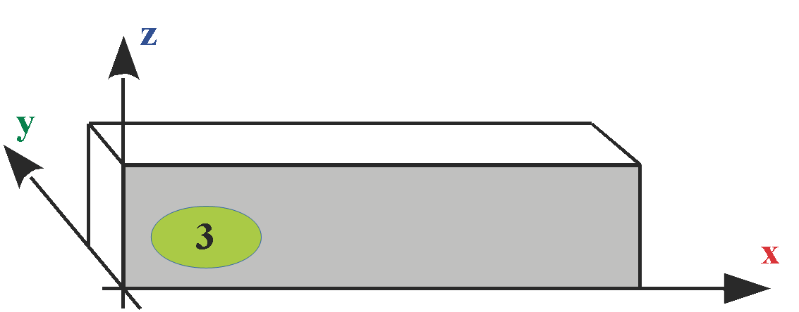

---

<h4 id="2.3.3-reference-planes">2.3.3 Reference planes</h4>

Definition of the reference planes of hexahedral components: UG, OG, LS, QS, RT

---

<h4 id="2.3.4-reference-edges">2.3.4 Reference edges</h4>

Definition of the reference edges of components: UG, OG, LS, QS, RT

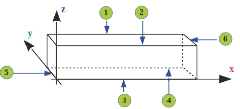

---

<h4 id="2.3.5-plane-coordinate-system">2.3.5 Plane coordinate system</h4>

The component processing steps PSG, TA, KN, MPL, PAF, PZF, PSF and the RBE2 spatial processing plane are based on the following definitions of the plane and the following coordinate systems:

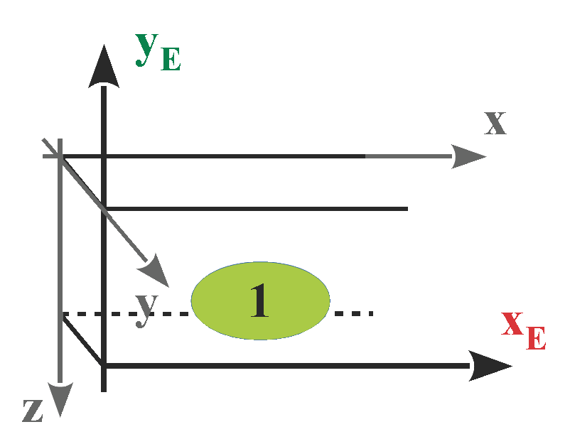

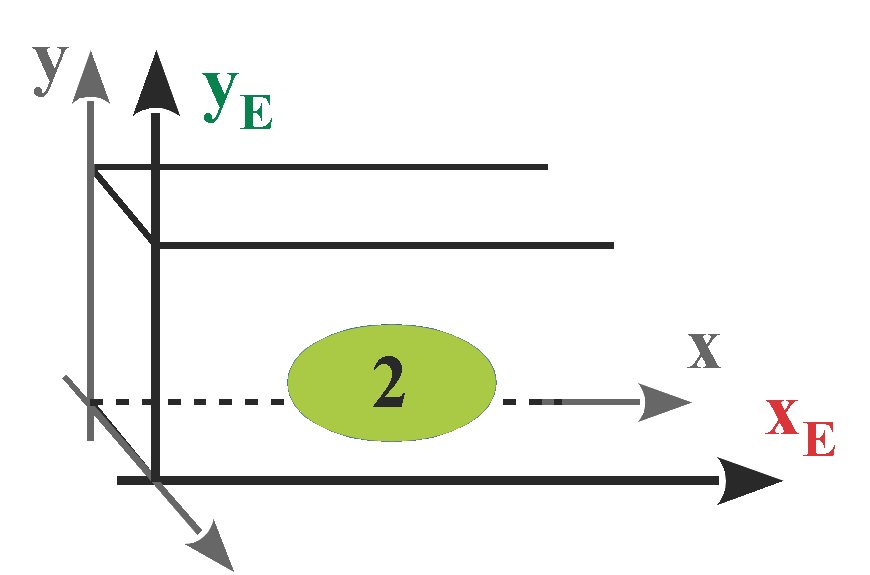

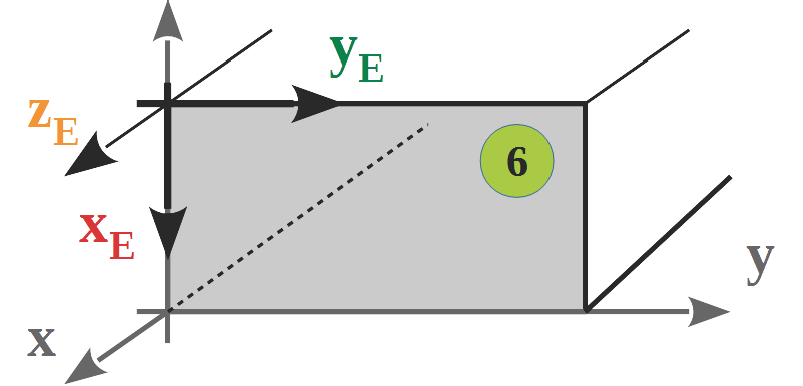

---

<h4 id="2.3.6-spatial-processing-coordinate-system">2.3.6 Spatial processing coordinate system</h4>

The definition of a spatial processing plane defines a new coordinate system.

All processing steps applied to it must be defined with reference plane 2.

Original plane

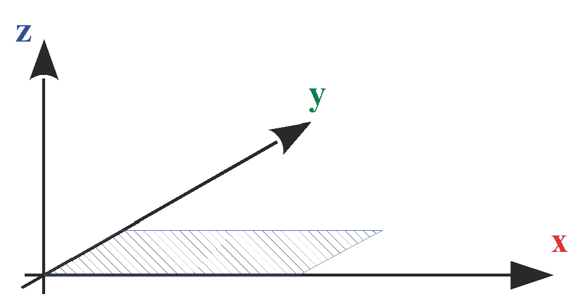

Transformation of the original plane via rotation around the Z axis

---

Transformation of the plane via tilting around the X' axis

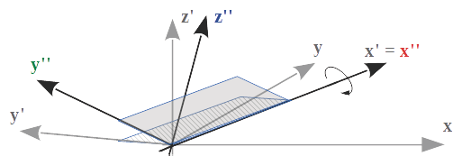

---

<h3 id="2.4-processing-the-file">2.4 Processing the file</h3>

When processing a wup file, you must take into account that component and processing definitions can contain incomplete parameter sets.

A processing program of a wup file should check the minimum number of parameters and complete missing values by adding default values. The default values are always specified in the relevant definition by values that are placed in curly brackets.

New parameters added are always located at the end of the parameter set. They never replace preceding parameters. If parameters contradict other parameters, the parameters to the right have priority.

---

<h2 id="3-change-history">3 Change history</h2>

<h3 id="3.1-changes-from-interface-version-1.x">3.1 Changes from interface version 1.x</h3>

- Interface version number introduced; Keyword: VERSION
- BT4 and BT6 replace QSS
- Introduction of element-oriented (ABE) and component-oriented (ABB) sections
- The keyword SG replaces SGO and SGU
- PLI1...PLI9 and PLA1...PLA9 replace SPI, SPA, and RPI
- Introduction of the blocked zone SZ for the bottom and top plates
- Introduction of the MPL marking line
- Introduction of the assembly keywords MODUL and ENDMODUL
- Introduction of built-in parts (EBT)

---

<h3 id="3.2-changes-for-interface-version-2.x">3.2 Changes for interface version 2.x</h3>

**2.1**: Introduction of polygon trimming on components PFZ, PFY

**2.2**: Introduction of shuttering SLI, SLA

**2.3**: The changes for interface version 2.3 are not documented

---

<h3 id="3.3-changes-for-interface-version-3.x">3.3 Changes for interface version 3.x</h3>

<h4 id="3.3.1-interface-version-3.0">3.3.1 Interface version 3.0</h4>

- Introduction of the series REIHE
- Keywords ABE/ABB, NBA, PNR are no longer required
- Component processing steps are generally sized in the component coordinate system
- Panel processing steps are generally sized in the element coordinate system
- NBR is limited to use with wood components
- Introduction of the standard notch in roof production: REFKER
- Additional parameters added for the material index and name for panels and components
- Introduction of the polygon which describes the outline, after the panel definition
- The combination PP, PP is no longer permitted for blocked areas

---

<h4 id="3.3.2-interface-version-3.1">3.3.2 Interface version 3.1</h4>

- Introduction of the NC program call-up for components.
- Addition of the keyword SG for components.
- Introduction of the protection zone in panel processing.
- Additional parameters for the depth and index for centers of circles MP
- Introduction of the marking line for panel processing.
- Introduction of the tilt angle for saw and trim lines in panel processing.
- Introduction of floating point numbers for angles and radii.

---

<h4 id="3.3.3-interface-version-3.2">3.3.3 Interface version 3.2</h4>

- Introduction of the arc.
- Introduction of the Z coordinates for polygon points.
- Addition of the keyword WNP (workpiece zero point) to the file header.
- Additional parameters for the keyword KN (beam processing): y, z, i
- The keyword also applies to layer processing

---

<h4 id="3.3.4-interface-version-3.3">3.3.4 Interface version 3.3</h4>

- Introduction of the Z ordinate for: OG, UG, LS, QS, EBT, BT4, BT6, PLI, PLA, SLI, SLA, MODUL
- Component name is no longer optional for: OG, UG, LS, QS, EBT, BT4, BT6, PLI, PLA, SLI, SLA
- Introduction of the tilt angle β for SG
- Change for NC
- The keywords PAF and PSG are also valid for beam processing
- Expansion of the polygon trimming line and the polygon saw cut around the reference plane for beam processing.
- Introduction of the PZF tenon joint for beam processing.
- Introduction of planes 5 and 6 for beam processing.
- Introduction of planes 7 and 8 for component BT6
- Introduction of the processing group. Keywords UNIT and ENDUNIT
- The keyword PLZ is no longer required
- PFY and PFZ designated as obsolete. Replacement PAF with reference plane.
- Introduction of spatial processing plane RBE for beams.
- Special rule for depth = 0. Utilization of the entire layer thickness and/or component thickness.
- Layers 0 and 10 introduced: PLI0, PLA0, PLI10, PLA10, SLI10, SLA10
- The workpiece zero point WNP is limited to the value "Bottom left".

---

<h4 id="3.3.5-interface-version-3.4">3.3.5 Interface version 3.4</h4>

- Supports Unicode format (UTF-16/BMP)
- Introduction of definitions in the file header: CAD, CADRELEASE
- Withdrawal of the WNP definition in the file header.
- Introduction of components RT, BTn
- Introduction of spatial processing plane RBE2, ENDRBE2
- Introduction of processing step TA
- Introduction of a definition for attributes of a component: PROPERTY
- The polygon blocked surface PSF can be used in the context of component processing steps.
- Additional parameters for the tool number for the processing steps PAF, ...
- Withdrawal of the keywords: BOX, BOY, BOZ, FRZ, FRY, PFY, PFZ, KER and RBE. These definitions should no longer be used in future. There is an adequate replacement for each one
- Withdrawal of Z-alignment within the installation position. See: Installation position of UG, OG, LS, QS, EBT. This should no longer be used in future.
- KN as a panel processing step no longer has any specification of the reference plane
- The trimming as part of the PAF processing step is controlled via parameters
- Some parameters, optional until interface version 3.3, are now mandatory
- The special rules for interface version 3.3 have been removed
- Thousands position removed in the control code of marking lines.

---

<h4 id="3.3.6-interface-version-3.6">3.3.6 Interface version 3.6</h4>

- Introduction of PAL (polygon application line)

---

<h2 id="4-syntax">4 Syntax</h2>

<h3 id="4.1-file-header">4.1 File header</h3>

Elements of the file header must be located at the beginning of each file.

The keyword VERSION, with information about the interface version, must be in the first line of the file.

|Command | Parameters | Optional | Description |
| :---	|	:---	|	:---	|	:--- |
|VERSION | Version.issue | |Version and output Example: 3.5|
|ANR |number| X | Number of the order|
| ELB| name| X |Element name for unique identification of the wall type. Permitted characters: a-z, A-Z, 0-9 and _|
|ELN |name| X |Element name|
|ZNR| number| X| Drawing number|
|SERIES| number| X| Production sequence|
|STACK| number| X| Label of the loading unit|
|ELA| view| |Element view {INSIDE} Value range: INSIDE, OUTSIDE, INTE- RIOR, EXTERIOR, INTERNAL, EXTERNAL|
|ELM |lx, by, hz [,n [,xoffset[,yoffset]]]  |
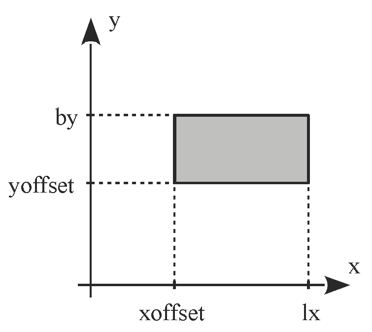
|Element dimensions of a prefabricated house element. lx: maximum value of the x ordinate (:float) by: maximum value of the y ordinate (:float) hz: maximum value of the z ordinate (:float) n: quantity {1} (:unsigned int) xoffset: offset dimension in x direction {0} (:float) yoffset: offset dimension in y direction {0} (:float)|
| WNP| value| X |Workpiece zero point Sole permissible value: BOTTOM LEFT WNP should no longer be used.|
| CAD | value | X| Specification of the CAD program (free text)|
|CADRE- LEASE| value| X| Specification of the CAD version (free text)|

 If optional commands such as ZNR, ELB etc. are specified, they must be followed by a valid value or a non-blank character string.

---

<h3 id="4.2-components">4.2 Components</h3>

<h4 id="4.2.1-single-components-single-bars">4.2.1 Single components, single bars</h4>

| Command | Parameters |  Description |
|:---:	|	:---:	|		:---: |
|OG |lx, by, hz, x, y, i, name, z |Upper beam lx: length by: width hz: height x, y: position i: material index and installation position name: component designation (optional up to interface version 3.1) z: position {0}|
|UG |lx, by, hz, x, y, i, name, z |Bottom plate: parameters and syntax as for top plate|
|RS |lx, by, hz, x, y, i, name, z |Longitudinal stud: parameters and syntax as for top plate|
|CS |ly, bx, hz, x, y, i, name, z |Beam ly: length, along the Y axis bx: width, along the X axis Remaining parameters and syntax as top plate|
|BT4| lx, by, hz, x11, y11, x12, y12, x21, y21, x22, y22, i, name, z 

|Component with 4 corner points lx: length by: width hz: height x11, y11: coordinates, point 1.1 x12, y12: coordinates, point 1.2 x21, y21: coordinates, point 2.1 x22, y22: coordinates, point 2.2 i: material index name: component name z: position {0}Points P1.1...P2.2 were called Plu, Pru, Pro and Plo in previous versions. The line P1.1-P2.2 and/or P1.2-P2.1 deter- mines the timber grain direction and forms the basis of the length calculation. Both lines must be parallel. If points coincide, the remaining line is used as a reference.|
|BT6| lx, by, hz, x11, y11, x12, y12, x13, y13, x21, y21, x22, y22, x23, y23, i, name, z 
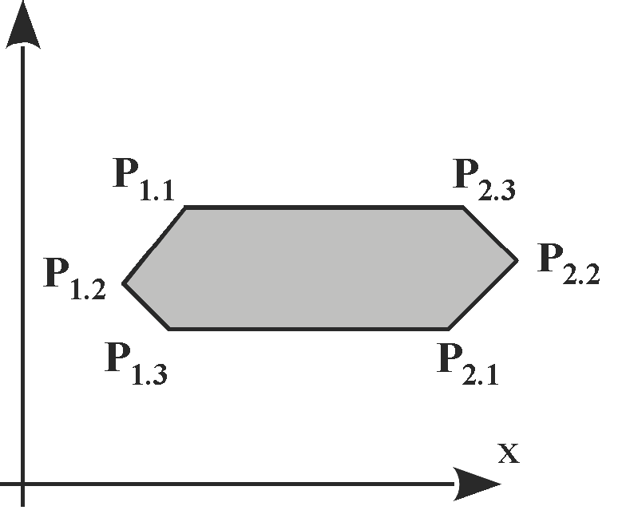
 |Component with 6 corner points lx: total length by: total width hz: total height x11, y11: coordinates, point 1.1 x12, y12: coordinates, point 1.2 x13, y13: coordinates, point 1.3 x21, y21: coordinates, point 2.1 x22, y22: coordinates, point 2.2 x23, y23: coordinates, point 2.3 i: material index name: component name z: position {0} The length of the component is calculated from the maximum distance of P1.x to P2.x Points P1.1...P2.3 were called Plu, Pmu, Pru, Pro, Pmo and Plo in previous versions. The line P1.1-P2.3 and/or P1.3-P2.1 deter- mines the timber grain direction and forms the basis of the length calculation. Both lines must be parallel. If points coincide, the remaining line is used as a reference.|
| BTn| lx, by, hz, x, y, z, i, name |Component with N corner points, followed by polygon points of the types PP or KB lx: total length by: total width hz: total height x, y, z: position i: material index name: component name|
|EBT |lx, by, hz, x, y, i, name, z |Built-in part, e.g. iron girder, triangular studs, etc. lx: length by: width hz: height x,y,z: installation position i: material index and installation position name: item name z: position {0}|

---

For the components LS, QS, OG, UG, BT4 and BT6 the parameter [z] was optional up to interface version 3.3.

All data types, with the exception of "name" and "i": floating point number

Data type of i: natural number

Data type of name: character string

All readable characters from the ASCII character set are allowed.

Exceptions:, < > : # $ % = ; ! \ |

---

<h4 id="4.2.2-panels-and-shuttering">4.2.2 Panels and shuttering</h4>

The start of a panel definition or shuttering definition starts the definition of a component position. It ends with the start of a new panel or shuttering definition for a different position.

| Command | Parameters |  Description |
|:---:	|	:---:	|		:---: |
|PLI0 … PLI10 |lx, by, hz, x, y, i, name [, z] |Inside panels, layer 0–10 lx: length by: width hz: height x, y: position i: material index name: name z: position {value is calculated} **Note**: PLI0 is a panel within the beam layer.|
|PLA0 … PLA10|lx, by, hz, x, y, i, name [, z] |Outside panels, layer 0–10 lx: length by: width hz: height x, y: position i: material index name: name z: position {value is calculated} **Note**: PLA0 is a panel within the beam layer.|
|SLI1 … SLI10|lx, by, hz, xlu, ylu, xmu, ymu, xru, yru, xro, yro, xmo, ymo, xlo, ylo, i, name [,z]|Inside shuttering, layer 1–10 lx: length by: width hz: height xlu, ylu: bottom left coordinates xmu, ymu: bottom center coordinates xru, yru: bottom right coordinates xro, yro: top right coordinates xmo, ymo: top center coordinates xlo, ylo: top left coordinates i: material index name: name z: position {value is calculated}|
|SLA1 … SLA10|lx, by, hz, xlu, ylu, xmu, ymu, xru, yru, xro, yro, xmo, ymo, xlo, ylo, i, name [,z]|Outside shuttering 1–10 lx: length by: width hz: height xlu, ylu: bottom left coordinates xmu, ymu: bottom center coordinates xru, yru: bottom right coordinates xro, yro: top right coordinates xmo, ymo: top center coordinates xlo, ylo: top left coordinates i: material index name: name z: position {value is calculated}|

---

The parameter [z] was optional up to interface version 3.3.

All data types, with the exception of "name" and "i": floating point number

Data type of i: natural number

Data type of name: character string

All readable characters from the ASCII character set are allowed.

Exceptions:, < > : # $ % = ; ! \ |

Note

- Panels are generally defined precisely by the outlining polygon.
- If polygon points are specified for PLI and PLA, the definition of the polygon points takes precedence over the parameters "lx" and "by". In total, polygon points must define one plane. Optional, missing attributes of PLI or PLA can be specified in more detail using attributes of the polygon points. The polygon points must describe precisely one surface. The polygon path should be closed. It is not possible to define warped planes.
- If different height definitions are specified within a panel layer, the lowest height applies as the height for the entire panel layer. This means that at certain positions, the tool is lower than permissible and there is a risk of collision. Therefore, define the Z coordinates of all panels completely.
- Panels with a height of 1 mm and less are not taken into account during the offset calculation.

---

<h4 id="4.2.3-unprocessed-parts">4.2.3 Unprocessed parts</h4>

Nesting can be defined using unprocessed parts.

An unprocessed part can contain one or more components of the types LS, QS, OG, UG, BTn. The unprocessed part itself does not have any processing steps.

| Command | Parameters |  Description |
|:---:	|	:---:	|		:---: |
|RT| lx, by, hz, x, y, z, i, name | Unprocessed part, followed by component definitions lx: total length(:float) by: total width(:float) hz: total height(:float) x, y, z: position(:float) i: material index(:ushort) name: component name(:string) All readable characters of the ASCII character set are allowed. Exceptions: \,  \<  \>  \:  \#  \$  \%  \=  \;  \!  \\  \||
|ENDRT| |End of the unprocessed part definition|

---

<h4 id="4.2.4-modules">4.2.4 Modules</h4>

Defines prefabricated components, and their processing steps, that are combined into an assembly.

| Command | Parameters |  Description |
|:---:	|	:---:	|		:---: |
|MODULE |lx, by, hz, x, y, name[,z] |Assembly, followed by components and their processing steps lx: length(:float) by: width(:float) hz: height(:float) x, y: position(:float) name: name(:string) All readable characters of theASCII character set are allowed. Exceptions: \,  \<  \>  \:  \#  \$  \%  \=  \;  \!  \\  \| z: position {0}(:float)|
|ENDMODULE || End of assembly definition|

Components and processing steps within a module refer to an element coordinate system that starts in the origin of the module.

---

<h3 id="4.3-spatial-processing-plane">4.3 Spatial processing plane</h3>

The spatial processing plane defines a new coordinate system.

| Command | Parameters |  Description |
|:---:	|	:---:	|		:--- |
| RBE2 | e, x, y, z,α, γ, δ | Spatial processing plane for beams e: reference plane Range:<ul> <li> Component processing: 1...6 </li><li>Panel processing: 2 </li> </ul>x,y,z: position α: rotation angle to the X axis γ: tilt angle to the y' axis δ: rotation angle to the x'' axis |                
| ENDRBE 2| |End of the spatial processing plane |

Data types: floating point number. Exceptions "e": Natural numbers

Processing steps that can be combined with RBE2 are: PAF, PZF, and TA

The processing steps within an RBE2/ENDRBE2 bracket with the same nesting index refer to the coordinate system drawn out with RBE2.

The spatial processing plane RBE2 can generally be nested. However, only one nesting level is possible at present.

For panel and layer processing steps, the specification ‚e‘ is ignored and the position x, y, z is specified in the element coordinates system.

Rotations around alpha α, gamma γ and delta δ follow shifts in the X, Y and Z directions. The dependency of the angles is: delta is dependent on gamma, gamma is dependent on alpha.

Alpha describes a rotation around the Z axis, gamma a rotation around the X axis, and delta a rotation around the z" axis. In each case the rotation is in the mathematically positive direction, i.e. for a coordinate arrow directed towards itself, counter-clockwise.

The depth of eroding processing must be specified as a positive value. The processing operates counter to the z" axis of the new coordinate system drawn out. Specifications of the length refer to the x" axis, width specifications to the y" axis.

---

No longer supported form of the spatial processing plane

| Command | Parameters |  Description |
|:---:	|	:---:	|		:--- |
| RBE|  x, y, z, α, γ, e | Spatial processing plane for beams x, y, z: position α: observe the rotation angle of the RBE refer- ence plane γ: observe the tilt angle of the RBE reference plane e: reference plane Value range: 1...4 Note:This keyword has been withdrawn.|

---

<h3 id="4.4-operations">4.4 Operations</h3>

<h4 id="4.4.1-component-processing-steps">4.4.1 Component processing steps</h4>

Component processing steps can be applied to the components: UG, OG, LS, QS, BT4, BT4, BTn, RT

| Command | Parameters |  Description |
|:---:	|	:---:	|		:--- |
|SG |x, y, z, α, γ, h, e, i [, β [, s]] |Sawing x, y, z: position in the element coordinate system α: rotation angle of the saw γ: tilt angle of the saw h: depth of the saw cut perpendicular to the reference plane in the position (x,y,z) e: reference plane for angle (1–6) i: control code 1 = positive correction relative to the X axis 2 = negative correction relative to the X axis 3 = no correction For reference plane 5 and 6, the correction is relative to the Y axis. β: gradient angle in the cutting surface {0} s: s = 1: relative to the cutting surfaces s = 0: Relative to reference edges (standard value) Note: SG defines a half-plane along the sawing line. Define point-to-point saw cuts with PSG.|
|KN |x, e, txt [, y [, z [, i] ] ] |Labeling x: position e: reference plane txt: identification (40 character limit) All readable characters from the ASCII character set are allowed. Exceptions: \, \< \> \: \# \$ \% \= \; \! \\ \| y: position {0} z: position {0} i: control code {0}|
|MPL |xa, ya, xe, ye, i, e| Marking line xa, ya: start point xe, ye: end point i: control code e: reference plane Note: PML will replace MPL in the medium-term.|
|PML| e | Marking line, subsequent polygon points e: reference plane|
|PAF| e [ ,i [, T ] ] |Start of countersinking, subsequent polygon points e: reference plane i: trimming according to the rules of the machine (0), no trimming (1), trimming (2) {0} T: tool number {0} Up to and including interface version 3.3, the machine's control system determined whether the material was trimmed depending on the contour surface. There was no trimming with complex contours. Complex contours are those with which the surface cannot be calculated directly. From interface version 3.4, the polygon trimming (PAF) control code controls whether trimming takes place.|
|PSG| e [, T] |Start of a sawing polygon, subsequent polygon points e: reference plane T: tool number {0} Note: PSG must not separate a component longitudinally. Only polygon points of the type "PP" permitted|
|PZF| e |Start of a tenon joint, subsequent polygon points e: reference plane|
|SZ |x, l |Blocked zone of plates. This zone describes the area between two elements that are attached to one another (e.g. in a "multiwall"). No processing can take place in this area. In addition, any processing of an overhanging panel cannot infringe on this zone (e.g. a mounting). x: position on the plate l: length of the blocked zone|

Note The tool number T = 0 causes the machine to determine the tool.

---

Processing steps no longer supported

| Command | Parameters |  Description |
|:---:	|	:---:	|		:--- |
|KER |x, txt |Standard notch for roofing parts x: position txt: designation 2 x SG replaces KER completely|
|REFKER| x,txt |Standard notch for roofing parts x: position txt: designation|
|BOZ| x, y, d, t |Drilling in the Z direction x, y: position d: diameter t: signed depth in the Z direction PAF/MP replaces BOZ|
|BOY| x, z, d, t |Drilling in the Y direction x, z: position d: diameter t: signed depth in the Y direction PAF/MP replaces BOY|
|BOX |y, z, d, t |Drilling in the X direction y, z: position d: diameter t: signed depth in the X direction PAF/MP replaces BOX|
|FRZ |x, xb, ty, tz |Trimming in the z direction x: position xb: trimming width ty: depth in the Y direction tz: signed depth in the Z direction PAF/PP replaces FRZ|
|FRY| x,xb,ty,tz |Trimming in the Y direction x: position xb: trimming width ty: depth in the Y direction tz: signed depth in the Z direction PAF/PP replaces FRY|
|PFZ| tz |Trimming in the z direction tz: signed depth in the Z direction Subsequent trimming polygon PAF/PP replaces PFZ|
|PFY| ty |Trimming in the Y direction ty: signed depth in the Y direction Subsequent trimming polygon PAF/PP replaces PFY|

All data types, with the exception of "e", "i" and "txt": floating point number

Data types of e and i: natural number

Data type of txt: character string

If a number value is specified as less than zero in the case of the signed depth for BO_, FR_ and PF_, the depth takes effect in the opposite direction to the direction of the corresponding coordinate axis.

---

<h4 id="4.4.2-panel-processing-steps-shuttering-processing">4.4.2 Panel processing steps, shuttering processing</h4>

Panel processing steps can be applied to the components: PLI, PLA, SLI, and SLA

The execution of the panel processing steps takes place counter to the Z ordinate.

| Command | Parameters |  Description |
|:---:	|	:---:	|		:--- |
|PAF| [e [, i [, T ] ] ]| e: reference plane { 2} i: trimming according to the rules of the machine (0), no trimming (1), trimming (2) {0} T: tool number { 0} Up to and including interface version 3.3, the machine's control system determined whether the material was trimmed depending on the contour surface. There was no trimming with complex contours. Complex contours are those with which the surface cannot be calculated directly. From interface version 3.4, the polygon trimming (PAF) control code controls whether trimming takes place.|
|PSG | [e [, T ] ] |Start of a sawing polygon, subsequent polygon points of the type "PP" e: reference plane { 2} T: tool number { 0}|
|NR |xa, ya, xe, ye, a, i| Nail line xa, ya: position of the first nail point xe, ye: position of the last nail point a: nail distance i: control code for the nailing/ Stapling device The optional subsequent keyword NBR can specify a nail line in more detail.|
|NBR| x, y, i |Nail pattern, relative x, y: nail point-based relative coordinates i: control code for the nailing/ Stapling device NBR can only be used in conjunction with NR.|
|PSF ||Start of a blocked surface, subsequent polygon points. The polygon must be closed. There is no nailing or stapling within the defined range. → Only the combinations "PP-PP ..." or "MP" are permitted. The control code controls the scope of application.|
|PSZ ||Start of a protected zone, subsequent polygon points. No processing takes place in this area. The machine does not cross the specified surface (e.g. flush boxes). The polygon must be closed. → Only the combinations "PP-PP ..." or "MP" are permitted.|
|PML ||Marking line, subsequent polygon points|
|PAL |[e,[T] ] |Application line, followed by polygon points of type "PP" e: reference plane {2} T: tool number {0}|
|KN| x, txt, y, z, i| Labeling x, y, z: position txt: identification (40 character limit) All readable characters of theASCII character set are allowed. Exceptions:, \< \> \: \# \$ \% \= \; \! \\ \| i: control code {0}|

---

Processing steps no longer supported

| Command | Parameters |  Description |
|:---:	|	:---:	|		:--- |
|BOZ| x, y, d, t |Drilling in the Z direction x, y: drill position d: drill hole diameter t: bore hole depth|

All data types, with the exception of "e", "i" and "txt": floating point number

Data types of e and i: natural number

Data type of txt: character string

**Note** The tool number T = 0 causes the machine to determine the tool.

---

<h4 id="4.4.3-units">4.4.3 Units</h4>

Logical processing consisting of one or more individual processing steps.

| Command | Parameters |  Description |
|:---:	|	:---:	|		:--- |
|UNIT |name |Processing group, followed by individual processing steps. The order of the specified processing steps does not necessarily deter- mine the processing sequence. name: designation. The "@" character is reserved for internal use.|
|ENDUNIT|| End of the processing group|

---

<h4 id="4.4.4-external-nc-programs">4.4.4 External NC programs</h4>

The use of external NC programs is possible with NC. NC is being withdrawn.

|  |  |   |
|:---:	|	:---:	|		:--- |
|NC |prog-name [param]* |Call up NC program for special processes. The first parameter determines the program name. All other parameters go directly to the NC program. param: parameter (:string)|

---

<h4 id="4.4.5-assignment-of-signs-for-trimming-and-drilling">4.4.5 Assignment of signs for trimming and drilling</h4>

The depth for eroding processing is specified with positive numbers.

Exception: Withdrawn processing steps.

Processing is then counter to the Z axis of the respective plane coordinate system.

---

<h3 id="4.5-attributes-properties">4.5 Attributes, properties</h3>

Attributes and properties of individual structural elements are indicated by the keyword PROPERTY. PROPERTY can be used several times. PROPERTY follows directly behind the structural element that should be given a property.

Structural elements that can be provided with a PROPERTY: All components from 3.2.1 and 3.2.2 and all processing steps from 3.4.1 and 3.4.2.

| Command | Parameters |  Description |
|:---:	|	:---:	|		:--- |
|PROPERTY| n, w; |Property of a structural element n: name of the property w: value|
||Data type of 'n': |Character string.|
||Data type of 'w': |Either numerical value or character string in double quotation marks. On a conceptual level, numerical values are not speci- fied as a character string.|

A wood processing machine can use PROPERTY to control and optimize processing sequences. 
Ask the machine manufacturer which type of machine processes which attributes.

Improper utilization of reserved property names may lead to a machine malfunction.

Incomplete list of names of properties reserved by WEINMANN:

"Count", "ProducedCount", "SingleMemberNumber", "StackSize", "Group", "Package", "Storey", "StoreyType", "Designation", "Annotation", "AssemblyNumber", "OrderNumber", "Volume", "UserAttribute:Process", "UserAttribute:ELB"

---

<h3 id="4.6-polygon-paths">4.6 Polygon paths</h3>

You can use polygon definitions to specify some processing steps or components in more detail.

Unless specified otherwise, the following combinations are permitted:

- PP, followed by at least one element PP or KB
- KB, with at least one preceding element PP or KB
- MP and/or TA as a single element 

| Command | Parameters |  Description |
|:---:	|	:---:	|		:--- |
|PP |x, y, t, i, α, z |Polygon point of a polygon path or the start point x, y: position t: depth, counter to the Z axis of the reference plane at the point (x,y,z) i: control code α: tilt angle of the trimming or Sawing line z: position {0} Note: If PP is used in a panel outline or a blocked surface, the specification of x and y suffices. PAL are height neutral, depth t must be specified as 0. |
|KB |x, y, r, type, t, i, α, z |Target point of the arc x, y: position of the target point r: radius type: type of the arc Acw: clockwise arc (<= 180°) Acc: counterclockwise arc (<= 180°) ACW: clockwise arc (> 180°) ACC: counterclockwise arc (> 180°) t: depth, counter to the Z axis of the reference plane at the point (x,y,z) i: control code α: tilt angle of the trimming line z: position {0}|
|MP| xm, ym, r, t, i, zm |Center point xm, ym: position of the center point r: radius >0 = clockwise circle <0 = counterclockwise circle t: depth, counter to the Z axis of the reference plane at the point (x,y,z) i: control code zm: position {0}|
|TA| lx, by, xm, ym, z, t, r, α, δ, i 

 |Pocket. Defines internal trimming. lx, by: edge lengths of the pocket xm, ym, z: center point or pivot of the pocket t: processing depth r: corner radius { 0 } α: rotation angle, value range: +/- 360° { 0 } δ: shear angle, values: -90° < δ < +90° { 0 } i: control code|

All data types, with the exception of "type" and "i": floating comma number

Data types of i: natural number

Data type of type: character string

**Note**

- A polygon definition does not have to be closed.
- Polygon points have been available since interface version 3.2. From interface version 3.4, the Z ordinates are no longer optional
- Exception: PP in the context of a panel outline or of a blocked surface.
- For attributes of dual polygon points that cannot be interpolated, the attribute of the end point of a line or an arc applies
- The elements PP, KB, MP can be used for processing PAF, PZF, and PSF. They can also be used for the components PLI-x, PLA-x and BTn.
- The element TA can only be used for PAF processing
- PROPERTY must be inserted between the component/processing keyword and PP/KB/MP/TA.

---

<h2 id="5-material-index-installation-position">5 Material index, installation position</h2>

<h3 id="5.1-installation-position-of-ug-og-ls-qs-ebt">5.1 Installation position of UG, OG, LS, QS, EBT</h3>

The identification of the installation position via the material index is used in conjunction with automatic storage. It can be used to control the material flow through the machine.

|  |  |   
|:---:	|	:---	|	
|The ones position in the material index defines the installation position. |0: Normal|
||1: Flat and flush to the external side|
||2: Flat and flush to the internal side|
||3: flat in the center of the wall|

The definition of the Z position takes precedence over the installation position. 

The evaluation of the ones position is being withdrawn.

|  |  |   
|:---:	|	:---	|	
|The tens position in the material index defines the rotation around the longitudinal axis of the compo- nent.|0: Not rotated|
||1: rotated by 90°|
||2: rotated by 180°|
||3: rotated by 270°|

If the rotation and alignment are specified, the rotation takes effect before the alignment.

Different materials have different values in the hundreds position of the material index.

Example: Traverse studs, INNEN view

Definition i = 11 i = 20 i = 32

---

<h3 id="5.2-material-indices-for-components">5.2 Material indices for components</h3>

Different materials have different values in the hundreds position of the material index.

The numerical values 0 …9900 can be used as required.

The numerical values from 10000 to 29900 and from 32700 are reserved for internal purposes.

---

<h3 id="5.3-material-indices-for-panels-and-shuttering">5.3 Material indices for panels and shuttering</h3>

The material index identifies the type of panel.

|Material  | Index |   
|:---	|	:---	|
|Wood component |01-09|
|Fermacell |10-19|
|Soft fiber panel (Gutex, ...) |20-29|
|OSB |30-39|
|Chipboard| 40-49|
|Plaster-base sheeting |50-59|
|Plaster |60-69|
|Gypsum plasterboard |70-79|
|Plastic panel |80-89|
|Plywood panel |90-99|
|Plaster |100-109|
|Shuttering |110-119|
|Three-layer panel| 120-129|
|Glue |130-139|
|Insulating plate (Diffutherm)| 140-149|
|Insulating plate (Heraklith) |150-159|
|Planks |160-169|
|Adhesive tape |170-179|
|Film/vapor block |180-189*|
|Plywood panel |190-199|
|Hardboard |200-209|
|Profiled panel 1) |210-219|
|Porous concrete| 220-229|
|Cavity insulation: cellulose |230-239|
|Cavity insulation: soft wood fiber |240-249|
|Cavity insulation: mineral wool |250-259|
|Cavity insulation: fiberglass |260–269|

*Components in this index range have no influence on the offset and length calculation. 
The same applies for panels and shuttering with a thickness of 1 mm or less.

1) For example, trapezoidal or sinusoidal sheets

 

---

<h2 id="6-control-codes-for-processing-steps">6 Control codes for processing steps</h2>

<h3 id="6.1-sawing-and-polygon-trimming">6.1 Sawing and polygon trimming</h3>

The following control codes are used to control the saw or trimming unit.

  
|Control code  |PAF meaning  | PSG meaning  |
|:---:	|	:---	|	:---	|	
|1 |Cylindrical trimmer |Standard saw blade|
|2 |Trimmer with chamfer |Fine-toothed saw blade|
|3 |Trimmer for horizontal groove Chainsaw|
|4 |Vertical marking trimmer||
|5...9| Free| Free|
|10 |Overcutting trimming line |Overcutting cut|
|20| Undercutting trimming line |Undercutting cut|
|30...90| locked|

|  |  |   
|:---:	|	:---	|	
|100 |Tool radius correction "left" Workpiece is located to the right of the processing line|
|200 |Tool radius correction "right" Workpiece is located to the left of the processing line|
|300| No tool radius offset|
|400...900| locked|
|1000 |Synchro- nous rotation : Free|
|2000...9000| locked|

**Note**

The ones and thousands position of the control code cannot be interpolated. 
The reference point is therefore always the end point of a partial section of a polygon path.

Example:

Cylindrical trimmer (1) + overlapping (10) + tool radius correction to the right (200) + reverse rotation (0000) results in a control code of 211.

---

<h4 id="6.1.1-tool-category">6.1.1 Tool category</h4>

The ones position in the control code determines the tool category.

See the table under 6.1.

---

<h4 id="6.1.2-undercut-and-overcut">6.1.2 Undercut and overcut</h4>

The tens position in the control code determines the overcut and undercut.

Overcut: control code: xx1x

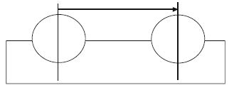

Undercut: control code: xx2x

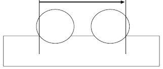

---

<h4 id="6.1.3-tool-radius-correction">6.1.3 Tool radius correction</h4>

The hundreds position in the control code determines the tool radius correction.

**Note** The reference for the tool radius correction is the processing direction.

***No tool radius correction (control code 300)***
Bearbeitungsrichtung

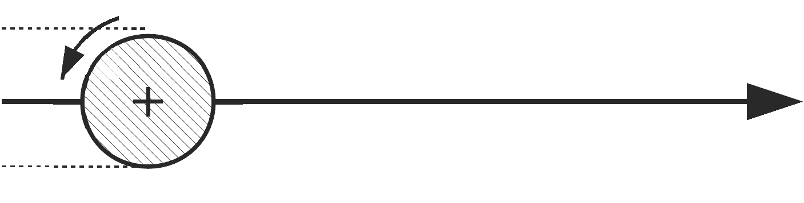

With control code 300, no differentiation between material waste and a required part is possible.

***Tool radius correction in the processing direction to the left (control code 100)***
Bearbeitungsrichtung

The material waste is located on the side of the chipping processing unit.

***Tool radius correction in the processing direction to the right (control code 200)***
Bearbeitungsrichtung 

The material waste is located on the side of the chipping processing unit.

---

<h4 id="6.1.4-synchronous-and-reverse-rotation">6.1.4 Synchronous and reverse rotation</h4>

The thousands position of the control code specifies synchronous or reverse rotation for the processing steps. See the table under 6.1.

---

<h4 id="6.1.5-examples">6.1.5 Examples</h4>

|  |  |   
|:---	|	:---	|	
|Circular notch in a clockwise direction PAF MP 3382,40,34,18,211;|

|
|Closed, rectangular notch <ul><li>PAF</li><li>PP 65,2201,34,121,0;</li><li> PP 133,2201,34,121,0; </li><li>PP 133,2269,34,121,0; </li><li>PP 65,2269,34,121,0;</li><li> PP 65,2201,34,121,0;</li></ul>|
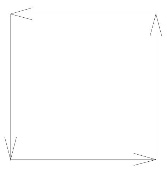
|
|Notch with arc <ul><li>PAF</li><li> PP 2000,0,16,211,0; </li><li>PP 2000,1800,16,211,0;</li><li> KB 3000,1800,800,</li><li>Acw,16,211,0;</li><li> PP 3000,0,16,211,0;</li></ul>|
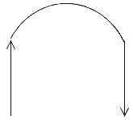
|

---

<h3 id="6.2-pocket-trimming">6.2 Pocket trimming</h3>

The trimming unit is activated via control codes.

| Control code  | Meaning |   
|:---:	|	:---	|	
|0| Overcut/undercut according to the machine rules|
|1| Overcut|
|2 |Undercut|

**Note**

The specification for overcut or undercut refers to all four corners of a pocket.

---

<h3 id="6.3-highlight">6.3 Highlight</h3>

The activation of the marking unit for MPL and PML processing is via control codes.

| Control code  | Meaning |   
|:---:	|	:---	|	
|1 |Inkjet printer|
|2 |Ballpoint pen|
|3 |Marking awl|
|10 |Marking on the opposite plane|
|20 |Marking on the definition plane/layer|
|100 |Line color: black|
|200| Line color: blue|
|300 |Line color: green|

**Note** The control codes cannot be interpolated. They are therefore always based on the end point of a partial section of a polygon path.

Example:

Black line with ballpoint pen on panel: 122

---

<h3 id="6.4-application-line">6.4 Application line</h3>

The activation of the application unit for PAL processing is via control codes.

| Control code  | Meaning |   
|:---:	|	:---	|	
|1| Sealing tape 60 mm|
|2 |Sealing tape 50 mm|
|3...9| Free|
|100 |Tool radius correction "left" Workpiece is located to the right of the processing line.|
|200 |Tool radius correction "right" Workpiece is located to the left of the processing line|
|300| No tool radius offset|
|400...900 |locked|

**Note** The control codes cannot be interpolated. They are therefore always based on the end point of a partial section of a polygon path.

Example:

50 mm sealing tape with tool radius correction to the left on the panel: 102

---

<h3 id="6.5-polygon-bocked-surfaces">6.5 Polygon bocked surfaces</h3>

The control code of a blocked surface qualifies the blocked surface for …

| Control code  | Processing class |   
|:---:	|	:---	|	
|0| Fixtures|
|1| Gluing|
|2| Plastering|
|3| Application line|

---

<h2 id="7-angles-and-radii">7 Angles and radii</h2>

<h3 id="7.1-rotation-and-tilt-angle-of-spatial-processing-plane-rbe2">7.1 Rotation and tilt angle of spatial processing plane RBE2</h3>

Starting from the image under 2.3.5, the transformation from Figure a.) to Figure b.) arises through the positive angle α.

The transformation from b.) to c.) arises through the positive angle γ.

A positive angle δ would rotate the plane from Figure c.) around the already transformed Z" axis again.

---

<h3 id="7.2-rotation-tilt-and-gradient-angle-of-the-saw-cut-sg">7.2 Rotation, tilt, and gradient angle of the saw cut SG</h3>

---

<h4 id="7.2.1-saw-cut-without-gradient-angle">7.2.1 Saw cut without gradient angle</h4>

| |  |   
|:---:	|	:---	|	
|6.1| Sawing line |
|6.2 |Reference edge |
|6.3 |Reference plane|

Please note:

The tilt angle γ relates to edges or surfaces depending on the value of the s bit.

See definition of the saw cut.

---

<h4 id="7.2.2-saw-cut-with-gradient-angle">7.2.2 Saw cut with gradient angle</h4>

| |  |   
|:---:	|	:---	|	
|6.1 |Sawing line|
|6.2 |Reference edge|
|6.3| Reference plane |
|6.4 |Line of the saw blade axis|

Please note:

In the reference drawing, the gradient angle β has a positive numerical value.

LS 4519.4,100,200,0,0,10000,valley jack rafter left,0;

SG 500,0,200,90.000,90.000,100,2,2,40.000,1;

---

<h3 id="7.3-tilt-angle-for-polygon-points-pp-kb-and-mp">7.3 Tilt angle for polygon points PP, KB, and MP</h3>

The tilt angle of a polygon point always references to the tangent of the processing line in the processing direction at this point.

If two sequential polygon points have different tilt angles, the tilt angle between the two points is interpolated linearly.

Positive tilt angle: clockwise in the direction of the processing line

Negative tilt angle: counter-clockwise in the direction of the processing line

---

<h3 id="7.4-radius-for-polygon-point-mp">7.4 Radius for polygon point MP</h3>

If the radius is specified as a positive value, an arc is processed in a clockwise direction.

If the radius is specified as a negative value, an arc is processed in a counterclockwise direction.

The data is based on a consideration counter to the Z axis of the relevant coordinate system.

---

<h2 id="8-examples">8 Examples</h2>

<h3 id="8.1-example-file-header">8.1 Example file header</h3>

| |  |   
|:---:	|	:---	|	
|   TXT |   Created by the wupEditor;|   
|   VERSION |   3.4;|   
|   ANR |   Order 1834;|   
|   ELB |   GABLE;|   
|   ELN |   gi003686;|   
|   ZNR |   4921;|   
|   SERIES |   1;|   
|   ELA |   INSIDE;|   
|   ELM |   8144, 2852, 192, 1;|   
|   CAD|   |   
|   CADRELEASE|   |   

---

<h3 id="8.2-example-components">8.2 Example: components</h3>

Upper beam

| |  |   
|:---:	|	:---	|	
|   OG  |  8932,80,80,0,2520,0,top plate,0;|   

Bottom plate (threshold)

| |  |   
|:---:	|	:---	|	
|   UG  |  8932,80,80,0,0,0,bottom plate,0;|   

Transverse stud

| |  |   
|:---:	|	:---	|	
|   CS  |  2440,80,80,0,80,0,stud-W,0;|   

Horizontal beam

| |  |   
|:---:	|	:---	|	
|   RS  |  890,60,80,4210,2100,0,head,0;|   

Component with 4 corner points

| |  |   
|:---:	|	:---	|	
|   BT4  |  2440,165,80,2375,80,2540,80,2540,2339,2375,2520,0,stud-S,0;|   

Component with 6 corner points

| |  |   
|:---:	|	:---	|	
|   BT6  |   2440,165,80,2375,80,2458,80,2540,80,2540,2339,2459,2520,2375,2520,0,stud-S, 0;|   

Built-in part

| |  |   
|:---:	|	:---	|	
|   EBT  |   890,60,80,4210,2100,1,iron girder,0|   

---

<h3 id="8.3-example-of-panels">8.3 Example of panels</h3>

Panel, layer 1, inside

| |  |   
|:---:	|	:---	|	
|PLI1| 643,2600,15,6251,0,40,chipboard,0;|
|PP |6251,0,15,0,0,0;|
|PP| 6894,0,15,0,0,0;|
|PP |6894,2600,15,0,0,0;|
|PP |6251,2600,15,0,0,0;|
|PP |6251,0,15,0,0,0;|

Panel, layer 2, inside

| |  |   
|:---:	|	:---	|	
|PLI2| 643,2600,15,6251,0,40,chipboard,0;|
|PP |6251,0,15,0,0,0;|
|PP |6894,0,15,0,0,0;|
|PP |6894,2600,15,0,0,0;|
|PP| 6251,2600,15,0,0,0;|
|PP| 6251,2600,15,0,0,0;|

Panel, layer 1, external side

| |  |   
|:---:	|	:---	|	
|PLA1| 643,2600,15,6251,0,40,chipboard,0;|
|PP |6251,0,15,0,0,0;|
|PP |6894,0,15,0,0,0;|
|PP |6894,2600,15,0,0,0;|
|PP |6251,2600,15,0,0,0;|
|PP |6251,0,15,0,0,0|

Panel, layer 2, external side

| |  |   
|:---:	|	:---	|	
|PLA2 |643,2600,15,6251,0,40,chipboard,0;|
|PP |6251,0,15,0,0,0;|
|PP |6894,0,15,0,0,0;|
|PP |6894,2600,15,0,0,0;|
|PP |6251,2600,15,0,0,0;|
|PP| 6251,0,15,0,0,0;|

---

<h3 id="8.4-example-slats-and-contra-slats">8.4 Example slats and contra slats</h3>

Contra slats

| |  |   
|:---:	|	:---	|	
|PLA1| 2579,70,24,58,0,3,PLA #1,0;|
|PP |58,0,24,0,0,0;|
|PP |2637,0,24,0,0,0;|
|PP |2637,70,24,0,0,0;|
|PP |58,70,24,0,0,0;|
|PP |58,0,24,0,0,0;|
|NR |78,48,2617,48,250,10;|
|PLA1 |5625,70,24,58,867,3,PLA #2,0;|
|PP |58,867,24,0,0,0;|
|PP |5683,867,24,0,0,0;|
|PP |58,937,24,0,0,0;|
|PP |58,867,24,0,0,0;|
|NR |78,902,4983,902,250,10;|

Slat

| |  |   
|:---:	|	:---	|	
|PLA2| 50,2744,38,319,0,PLA #1,0;|
|PP| 319,0,38,0,0,0;|
|PP |369,0,38,0,0,0;|
|PP |369,2744,38,0,0,0;|
|PP |319,2744,38,0,0,0;|
|PP| 319,0,38,0,0,0;|
|NR| 344,48,344,48,1,10;|
|NBR |0,0,2;|
|NR| 344,1828,344,1828,1,10;|
|NBR| 10,-5,2;|
|NBR| -10,5,2;|
|NR| 344,2729,344,2729,1,10;|
|NBR |10,10,2;|
|NBR |-10,-10,2;|

---

<h3 id="8.5-polygon-paths">8.5 Polygon paths</h3>

Closed polygon path

| |  |   
|:---:	|	:---	|	
|	PAF;||		
|	PP |	65,2201,34,121,0,0;|	
|	PP |	133,2201,34,121,0,0;|	
|	PP |	133,2269,34,121,0,0;|	
|	PP|	 65,2269,34,121,0,0;|	
|	PP|	 65,2201,34,121,0,0;|	

Open polygon path

| |  |   
|:---:	|	:---	|	
|	PAF;||		
|	PP |	100,0,20,111,0,0;|	
|	PP |	100,500,20,111,0,0;|	
|	PP |	200,700,20,111,0,0;|	
|	PP |	200,1000,20,111,0,0;|	
|	PP |	500,1000,20,111,0,0;|	
|	PP |	500,150,20,111,0,0;|	

Polygon path with arc	

| |  |   
|:---:	|	:---	|	
|PAF;||
|PP| 2000,0,16,211,0,0;|
|PP| 2000,1800,16,211,0,0;|
|KB| 3000,1800,800,Acw,16,211,0,0;|
|PP| 3000,0,16,211,0,0;|

Polygon path for lateral groove

| |  |   
|:---:	|	:---	|	
|PAF;||
|PP |40,0,35,113,0,30;|
|PP |40,1800,35,113,0,30;|

---

