# Interface version 3.7

<style>
.toc-table{width:100%; border-collapse:collapse;}
.toc-table td{padding:3px 6px; vertical-align:top; line-height:1.3;}
.toc-left{width:100%;}
.toc-right{text-align:right; white-space:nowrap;}
.toc-indent-0{padding-left:0; font-size:1.03rem; font-weight:700;}
.toc-indent-1{padding-left:20px; font-size:0.96rem; font-weight:600;}
.toc-indent-2{padding-left:40px; font-size:0.90rem; font-weight:500;}
.toc-indent-3{padding-left:60px; font-size:0.86rem; font-weight:500;}
.toc-indent-4{padding-left:80px; font-size:0.82rem; font-weight:500;}
img{max-width:100%; height:auto;}
.table{border-collapse:collapse; width:100%;}
.table th,.table td{border:1px solid #ddd; padding:4px;}
.table th{text-align:center;}
</style>
<h2>Table of Contents</h2>

<table class="toc-table">
  <tr><td class="toc-left toc-indent-0"><a href="#1-intended-use">1 Intended use</a></td><td class="toc-right">1</td></tr>
  <tr><td class="toc-left toc-indent-0"><a href="#2-general">2 General</a></td><td class="toc-right">4</td></tr>
  <tr><td class="toc-left toc-indent-1"><a href="#2.1-file-structure">2.1 File structure</a></td><td class="toc-right">5</td></tr>
  <tr><td class="toc-left toc-indent-1"><a href="#2.2-general-syntaxvalue-ranges">2.2 General syntax/value ranges</a></td><td class="toc-right">6</td></tr>
  <tr><td class="toc-left toc-indent-1"><a href="#2.3-coordinate-systems">2.3 Coordinate systems</a></td><td class="toc-right">7</td></tr>
  <tr><td class="toc-left toc-indent-2"><a href="#2.3.1-element-coordinate-system">2.3.1 Element coordinate system</a></td><td class="toc-right">8</td></tr>
  <tr><td class="toc-left toc-indent-2"><a href="#2.3.2-component-coordinate-system">2.3.2 Component coordinate system</a></td><td class="toc-right">9</td></tr>
  <tr><td class="toc-left toc-indent-2"><a href="#2.3.3-reference-planes">2.3.3 Reference planes</a></td><td class="toc-right">10</td></tr>
  <tr><td class="toc-left toc-indent-2"><a href="#2.3.4-reference-edges">2.3.4 Reference edges</a></td><td class="toc-right">11</td></tr>
  <tr><td class="toc-left toc-indent-2"><a href="#2.3.5-plane-coordinate-system">2.3.5 Plane coordinate system</a></td><td class="toc-right">12</td></tr>
  <tr><td class="toc-left toc-indent-2"><a href="#2.3.6-spatial-processing-coordinate-system">2.3.6 Spatial processing coordinate system</a></td><td class="toc-right">13</td></tr>
  <tr><td class="toc-left toc-indent-1"><a href="#2.4-processing-the-file">2.4 Processing the file</a></td><td class="toc-right">15</td></tr>
  <tr><td class="toc-left toc-indent-0"><a href="#3-change-history">3 Change history</a></td><td class="toc-right">16</td></tr>
  <tr><td class="toc-left toc-indent-1"><a href="#3.1-changes-from-interface-version-1.x">3.1 Changes from interface version 1.x</a></td><td class="toc-right">16</td></tr>
  <tr><td class="toc-left toc-indent-1"><a href="#3.2-changes-for-interface-version-2.x">3.2 Changes for interface version 2.x</a></td><td class="toc-right">17</td></tr>
  <tr><td class="toc-left toc-indent-1"><a href="#3.3-changes-for-interface-version-3.x">3.3 Changes for interface version 3.x</a></td><td class="toc-right">18</td></tr>
  <tr><td class="toc-left toc-indent-2"><a href="#3.3.1-interface-version-3.0">3.3.1 Interface version 3.0</a></td><td class="toc-right">18</td></tr>
  <tr><td class="toc-left toc-indent-2"><a href="#3.3.2-interface-version-3.1">3.3.2 Interface version 3.1</a></td><td class="toc-right">19</td></tr>
  <tr><td class="toc-left toc-indent-2"><a href="#3.3.3-interface-version-3.2">3.3.3 Interface version 3.2</a></td><td class="toc-right">20</td></tr>
  <tr><td class="toc-left toc-indent-2"><a href="#3.3.4-interface-version-3.3">3.3.4 Interface version 3.3</a></td><td class="toc-right">21</td></tr>
  <tr><td class="toc-left toc-indent-2"><a href="#3.3.5-interface-version-3.4">3.3.5 Interface version 3.4</a></td><td class="toc-right">22</td></tr>
  <tr><td class="toc-left toc-indent-2"><a href="#3.3.6-interface-version-3.5">3.3.6 Interface version 3.5</a></td><td class="toc-right">23</td></tr>
  <tr><td class="toc-left toc-indent-2"><a href="#3.3.7-interface-version-3.6">3.3.7 Interface version 3.6</a></td><td class="toc-right">23</td></tr>
  <tr><td class="toc-left toc-indent-2"><a href="#3.3.8-interface-version-3.7">3.3.8 Interface version 3.7</a></td><td class="toc-right">23</td></tr>
  <tr><td class="toc-left toc-indent-0"><a href="#4-syntax">4 Syntax</a></td><td class="toc-right">24</td></tr>
  <tr><td class="toc-left toc-indent-1"><a href="#4.1-file-header">4.1 File header</a></td><td class="toc-right">24</td></tr>
  <tr><td class="toc-left toc-indent-1"><a href="#4.2-components">4.2 Components</a></td><td class="toc-right">26</td></tr>
  <tr><td class="toc-left toc-indent-2"><a href="#4.2.1-single-components-single-bars">4.2.1 Single components, single bars</a></td><td class="toc-right">26</td></tr>
  <tr><td class="toc-left toc-indent-2"><a href="#4.2.2-panels-and-shuttering">4.2.2 Panels</a></td><td class="toc-right">30</td></tr>
  <tr><td class="toc-left toc-indent-2"><a href="#4.2.3-unprocessed-parts">4.2.3 Unprocessed parts</a></td><td class="toc-right">32</td></tr>
  <tr><td class="toc-left toc-indent-2"><a href="#4.2.4-modules">4.2.4 Modules</a></td><td class="toc-right">33</td></tr>
  <tr><td class="toc-left toc-indent-1"><a href="#4.3-spatial-processing-plane">4.3 Spatial processing plane</a></td><td class="toc-right">34</td></tr>
  <tr><td class="toc-left toc-indent-1"><a href="#4.4-operations">4.4 Operations</a></td><td class="toc-right">36</td></tr>
  <tr><td class="toc-left toc-indent-2"><a href="#4.4.1-component-processing-steps">4.4.1 Component processing steps</a></td><td class="toc-right">36</td></tr>
  <tr><td class="toc-left toc-indent-2"><a href="#4.4.2-panel-processing-steps-shuttering-processing">4.4.2 Panel processing steps</a></td><td class="toc-right">40</td></tr>
  <tr><td class="toc-left toc-indent-2"><a href="#4.4.3-units">4.4.3 Units</a></td><td class="toc-right">42</td></tr>
  <tr><td class="toc-left toc-indent-2"><a href="#4.4.4-external-nc-programs">4.4.4 External NC programs</a></td><td class="toc-right">43</td></tr>
  <tr><td class="toc-left toc-indent-2"><a href="#4.4.5-assignment-of-signs-for-trimming-and-drilling">4.4.5 Assignment of signs for trimming and drilling</a></td><td class="toc-right">44</td></tr>
  <tr><td class="toc-left toc-indent-1"><a href="#4.5-attributes-properties">4.5 Attributes, properties</a></td><td class="toc-right">45</td></tr>
  <tr><td class="toc-left toc-indent-1"><a href="#4.6-polygon-paths">4.6 Polygon paths</a></td><td class="toc-right">46</td></tr>
  <tr><td class="toc-left toc-indent-0"><a href="#5-material-index-installation-position">5 Material index, installation position</a></td><td class="toc-right">48</td></tr>
  <tr><td class="toc-left toc-indent-1"><a href="#5.1-installation-position-of-ug-og-ls-qs-ebt">5.1 Installation position of UG, OG, LS, QS, EBT</a></td><td class="toc-right">48</td></tr>
  <tr><td class="toc-left toc-indent-1"><a href="#5.2-material-indices-for-components">5.2 Material indices for components</a></td><td class="toc-right">49</td></tr>
  <tr><td class="toc-left toc-indent-1"><a href="#5.3-material-indices-for-panels-and-shuttering">5.3 Material indices for panels and shuttering</a></td><td class="toc-right">50</td></tr>
  <tr><td class="toc-left toc-indent-1"><a href="#5.4-control-codes-for-components">5.4 Control codes for components</a></td><td class="toc-right">51</td></tr>
  <tr><td class="toc-left toc-indent-2"><a href="#5.4.1-control-codes-for-panels-with-defined-polygon-points">5.4.1 Control codes for panels with defined polygon points</a></td><td class="toc-right">51</td></tr>
  <tr><td class="toc-left toc-indent-0"><a href="#6-control-codes-for-processing-steps">6 Control codes for processing steps</a></td><td class="toc-right">51</td></tr>
  <tr><td class="toc-left toc-indent-1"><a href="#6.1-sawing-and-polygon-trimming">6.1 Sawing and polygon trimming</a></td><td class="toc-right">51</td></tr>
  <tr><td class="toc-left toc-indent-2"><a href="#6.1.1-tool-category">6.1.1 Tool category</a></td><td class="toc-right">52</td></tr>
  <tr><td class="toc-left toc-indent-2"><a href="#6.1.2-undercut-and-overcut">6.1.2 Undercut and overcut</a></td><td class="toc-right">53</td></tr>
  <tr><td class="toc-left toc-indent-2"><a href="#6.1.3-tool-radius-correction">6.1.3 Tool radius correction</a></td><td class="toc-right">54</td></tr>
  <tr><td class="toc-left toc-indent-2"><a href="#6.1.4-synchronous-and-reverse-rotation">6.1.4 Synchronous and reverse rotation</a></td><td class="toc-right">56</td></tr>
  <tr><td class="toc-left toc-indent-2"><a href="#6.1.5-examples">6.1.5 Examples</a></td><td class="toc-right">57</td></tr>
  <tr><td class="toc-left toc-indent-1"><a href="#6.2-pocket-trimming">6.2 Pocket trimming</a></td><td class="toc-right">58</td></tr>
  <tr><td class="toc-left toc-indent-1"><a href="#6.3-highlight">6.3 Highlight</a></td><td class="toc-right">59</td></tr>
  <tr><td class="toc-left toc-indent-1"><a href="#6.4-application-line">6.4 Application line</a></td><td class="toc-right">60</td></tr>
  <tr><td class="toc-left toc-indent-1"><a href="#6.5-polygon-bocked-surfaces">6.5 Polygon bocked surfaces</a></td><td class="toc-right">61</td></tr>
  <tr><td class="toc-left toc-indent-0"><a href="#7-angles-and-radii">7 Angles and radii</a></td><td class="toc-right">62</td></tr>
  <tr><td class="toc-left toc-indent-1"><a href="#7.1-rotation-and-tilt-angle-of-spatial-processing-plane-rbe2">7.1 Rotation and tilt angle of spatial processing plane RBE2</a></td><td class="toc-right">62</td></tr>
  <tr><td class="toc-left toc-indent-1"><a href="#7.2-rotation-tilt-and-gradient-angle-of-the-saw-cut-sg">7.2 Rotation, tilt, and gradient angle of the saw cut SG</a></td><td class="toc-right">63</td></tr>
  <tr><td class="toc-left toc-indent-2"><a href="#7.2.1-saw-cut-without-gradient-angle">7.2.1 Saw cut without gradient angle</a></td><td class="toc-right">64</td></tr>
  <tr><td class="toc-left toc-indent-2"><a href="#7.2.2-saw-cut-with-gradient-angle">7.2.2 Saw cut with gradient angle</a></td><td class="toc-right">65</td></tr>
  <tr><td class="toc-left toc-indent-1"><a href="#7.3-tilt-angle-for-polygon-points-pp-kb-and-mp">7.3 Tilt angle for polygon points PP, KB, and MP</a></td><td class="toc-right">66</td></tr>
  <tr><td class="toc-left toc-indent-1"><a href="#7.4-radius-for-polygon-point-mp">7.4 Radius for polygon point MP</a></td><td class="toc-right">67</td></tr>
  <tr><td class="toc-left toc-indent-0"><a href="#8-examples">8 Examples</a></td><td class="toc-right">68</td></tr>
  <tr><td class="toc-left toc-indent-1"><a href="#8.1-example-file-header">8.1 Example file header</a></td><td class="toc-right">68</td></tr>
  <tr><td class="toc-left toc-indent-1"><a href="#8.2-example-components">8.2 Example: components</a></td><td class="toc-right">69</td></tr>
  <tr><td class="toc-left toc-indent-1"><a href="#8.3-example-of-panels">8.3 Example of panels</a></td><td class="toc-right">70</td></tr>
  <tr><td class="toc-left toc-indent-1"><a href="#8.4-example-slats-and-contra-slats">8.4 Example slats and contra slats</a></td><td class="toc-right">71</td></tr>
  <tr><td class="toc-left toc-indent-1"><a href="#8.5-polygon-paths">8.5 Polygon paths</a></td><td class="toc-right">72</td></tr>
</table>

<h2 id="1-intended-use">1 Intended use</h2>

Interface description for prefabricated house elements
<p></p>


The party responsible for the development and maintenance of this interface is:

WEINMANN Holzbausytemtechnik GmbH, Forchenstr. 50, 72813 St. Johann, Germany

Interface version 3.7 (Work in Progress)

As at: 03/06/2026

The right to make changes is reserved.

---

<h2 id="2-general">2 General</h2>

This document describes the structure of an element of a prefabricated house.

With one exception, the document does not contain any specific definitions for specific machines.

WEINMANN recommends using the file extension "wup".


---

<h3 id="2.1-file-structure">2.1 File structure</h3>

The file must be available in MS-DOS text format. Line break: CR/LF (# 0D0A).

Permissible codings are: ASCII and UTF-16 (BMP, LITTLE ENDIAN).


- File header: VERSION, ANR, ELB, ELN, ZNR, REIHE, ELA, ELM, WNP, CAD, CADRE- LEASE
	- Optional: definition of unprocessed parts: RT
		- (A) Definition of components of the frame work, introduced by the definition of a component: UG, OG, LS, QS, BT4, BT6, EBT, BTn
			- Attributes of a component: PROPERTY
			- Component processing steps: UNIT, SG, PSG, TA, KN, MPL, PAF, PZF, PSF, SZ
			- Spatial processing plane RBE2, followed by component processing steps
		- (B) Definition of component positions, introduced by the definition of layered components of the same type: PLI0...PLI10, PLA0...PLA10
			- Layer processing steps: UNIT, PSG, PAF, PSF, NR, NBR, PSZ, PML, PAL, KN
			- Spatial processing plane RBE2, followed by the corresponding processing steps
		- (C) Definition of modules: MODUL, ENDMODUL
			- Definition of the component positions (B) or components of the frame work (A)


Multiple specifications of definitions of the categories (A), (B), or (C) are possible.

The definition of a category is completed by the definition of a new category. (t.b.d) wup keyword

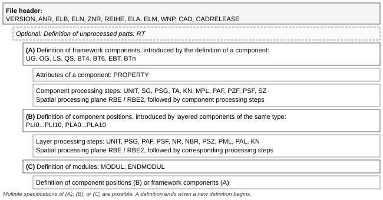

---

<h3 id="2.2-general-syntaxvalue-ranges">2.2 General syntax/value ranges</h3>

- Maximum line length: 250 characters
- Spaces and tabs are permissible between keywords and/or parameters
- Any line can be designed as a "comment" line. It begins with the keyword "TXT"
- Each definition of a header date, a component, a processing step, or a comment ends with the limiter ";". Characters behind this are comments.
- Parameter range for integers, unless specified otherwise: -32768 ... +32767
- Parameter range for floating point numbers, unless specified otherwise: +- 3.402 * 1038. Max. three decimal points separated by a point, up to +/- 10000000 not specified exponentially. Floating point numbers are used for lines, radii, angles, and coordinates
- Positions and dimensions are specified in mm
- Angles are specified in degrees
- Within full version numbers, such as 3.0-3.9, the keywords remain constant
- In this document, optional parameters are specified in square brackets (e.g. [Z]). Standard settings are specified in curly brackets (e.g. {0})
- "*" behind a parameter indicates any frequent reproducibility of the parameter
- Explicitly named data types are listed in brackets preceded by a colon. Character string (:string), floating point number (:float), integer (:int), natural number (:uint).
- Format of individual data types: Character string. Unless specified otherwise, printable characters, with the exception of semicolon and comma, max. 70 characters.
 
Floating point number:

Maximum three decimal places separated by a point, support for exponential notation of values larger than +10000000 and smaller than -10000000.

---

<h3 id="2.3-coordinate-systems">2.3 Coordinate systems</h3>

All coordinate systems are right-rotating coordinate systems.


---

<h4 id="2.3.1-element-coordinate-system">2.3.1 Element coordinate system</h4>

A right-rotating coordinate system is used as the basis for sizing components and layer processing steps.

For wall elements, the X direction is aligned with UG (bottom plate) and OG (top plate). For roof and ceiling elements, the X direction is aligned with LS, even if ELM is smaller than the element width.

<p>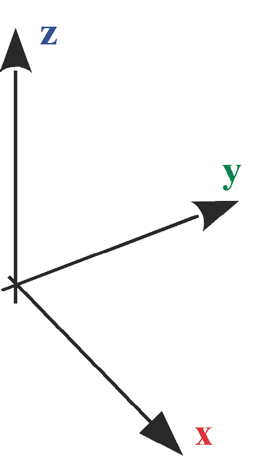</p>

<p><em>ELM reference (lx, by, xoffset, yoffset):</em></p>
<p></p>

---

<h4 id="2.3.2-component-coordinate-system">2.3.2 Component coordinate system</h4>

The component processing steps SG, SZ, PFZand REFKER are based on the following coordinate system:

<p></p>

---

<h4 id="2.3.3-reference-planes">2.3.3 Reference planes</h4>

Definition of the reference planes of hexahedral components: UG, OG, LS, QS, RT

<p>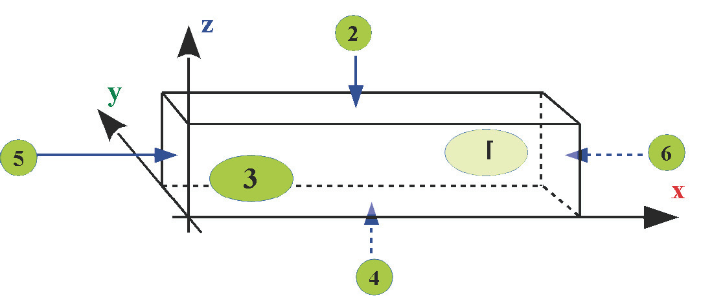</p>

---

<h4 id="2.3.4-reference-edges">2.3.4 Reference edges</h4>

Definition of the reference edges of components: UG, OG, LS, QS, RT

<p></p>

---

<h4 id="2.3.5-plane-coordinate-system">2.3.5 Plane coordinate system</h4>

The component processing steps PSG, TA, KN, MPL, PAF, PZF, PSF and the RBE2 spatial processing plane are based on the following definitions of the plane and the following coordinate systems:

<p></p>
<p></p>
<p>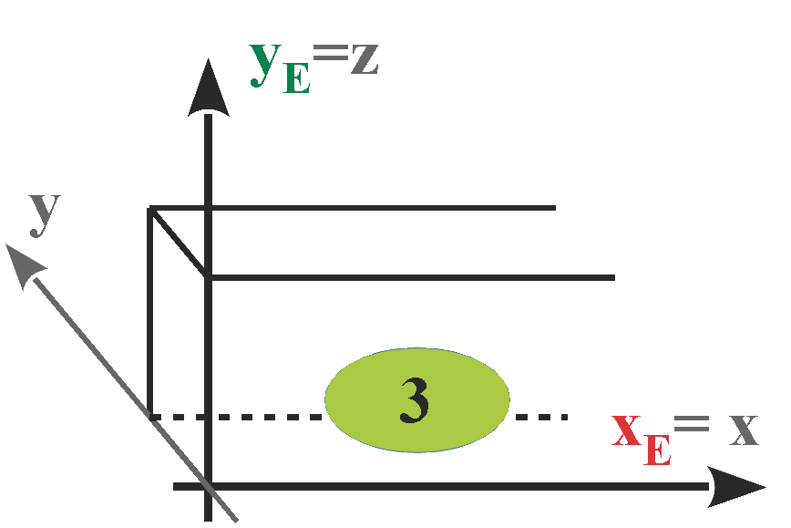</p>
<p>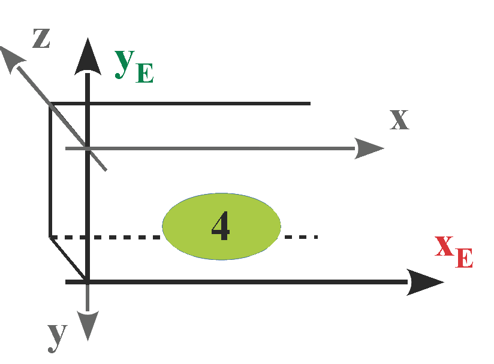</p>
<p>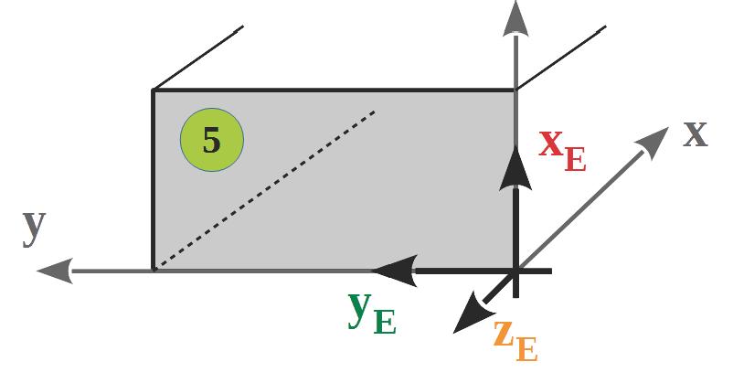</p>
<p></p>

---

<h4 id="2.3.6-spatial-processing-coordinate-system">2.3.6 Spatial processing coordinate system</h4>

The definition of a spatial processing plane defines a new coordinate system.

All processing steps applied to it must be defined with reference plane 2.

Original plane


<p></p>

Transformation of the original plane via rotation around the Z axis

<p>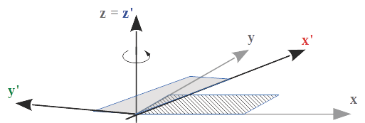</p>

---

Transformation of the plane via tilting around the X' axis

<p></p>

---

<h3 id="2.4-processing-the-file">2.4 Processing the file</h3>

When processing a wup file, you must take into account that component and processing definitions can contain incomplete parameter sets.

A processing program of a wup file should check the minimum number of parameters and complete missing values by adding default values. The default values are always specified in the relevant definition by values that are placed in curly brackets.

New parameters added are always located at the end of the parameter set. They never replace preceding parameters. If parameters contradict other parameters, the parameters to the right have priority.


---

<h2 id="3-change-history">3 Change history</h2>

<h3 id="3.1-changes-from-interface-version-1.x">3.1 Changes from interface version 1.x</h3>

- Interface version number introduced; Keyword: VERSION
- BT4 and BT6 replace QSS
- Introduction of element-oriented (ABE) and component-oriented (ABB) sections
- The keyword SG replaces SGO and SGU
- PLI1...PLI9 and PLA1...PLA9 replace SPI, SPA, and RPI
- Introduction of the blocked zone SZ for the bottom and top plates
- Introduction of the MPL marking line
- Introduction of the assembly keywords MODUL and ENDMODUL
- Introduction of built-in parts (EBT)

---

<h3 id="3.2-changes-for-interface-version-2.x">3.2 Changes for interface version 2.x</h3>

**2.1**: Introduction of polygon trimming on components PFZ, PFY

**2.2**: Introduction of shuttering SLI, SLA

**2.3**: The changes for interface version 2.3 are not documented


---

<h3 id="3.3-changes-for-interface-version-3.x">3.3 Changes for interface version 3.x</h3>

<h4 id="3.3.1-interface-version-3.0">3.3.1 Interface version 3.0</h4>

- Introduction of the series REIHE
- Keywords ABE/ABB, NBA, PNR are no longer required
- Component processing steps are generally sized in the component coordinate system
- Panel processing steps are generally sized in the element coordinate system
- NBR is limited to use with wood components
- Introduction of the standard notch in roof production: REFKER
- Additional parameters added for the material index and name for panels and components
- Introduction of the polygon which describes the outline, after the panel definition
- The combination PP, PP is no longer permitted for blocked areas

---

<h4 id="3.3.2-interface-version-3.1">3.3.2 Interface version 3.1</h4>

- Introduction of the NC program call-up for components.
- Addition of the keyword SG for components.
- Introduction of the protection zone in panel processing.
- Additional parameters for the depth and index for centers of circles MP
- Introduction of the marking line for panel processing.
- Introduction of the tilt angle for saw and trim lines in panel processing.
- Introduction of floating point numbers for angles and radii.

---

<h4 id="3.3.3-interface-version-3.2">3.3.3 Interface version 3.2</h4>

- Introduction of the arc.
- Introduction of the Z coordinates for polygon points.
- Addition of the keyword WNP (workpiece zero point) to the file header.
- Additional parameters for the keyword KN (beam processing): y, z, i
- The keyword also applies to layer processing

---

<h4 id="3.3.4-interface-version-3.3">3.3.4 Interface version 3.3</h4>

- Introduction of the Z ordinate for: OG, UG, LS, QS, EBT, BT4, BT6, PLI, PLA, SLI, SLA, MODUL
- Component name is no longer optional for: OG, UG, LS, QS, EBT, BT4, BT6, PLI, PLA, SLI, SLA
- Introduction of the tilt angle β for SG
- Change for NC
- The keywords PAF and PSG are also valid for beam processing
- Expansion of the polygon trimming line and the polygon saw cut around the reference plane for beam processing.
- Introduction of the PZF tenon joint for beam processing.
- Introduction of planes 5 and 6 for beam processing.
- Introduction of planes 7 and 8 for component BT6
- Introduction of the processing group. Keywords UNIT and ENDUNIT
- The keyword PLZ is no longer required
- PFY and PFZ designated as obsolete. Replacement PAF with reference plane.
- Introduction of spatial processing plane RBE for beams.
- Special rule for depth = 0. Utilization of the entire layer thickness and/or component thickness.
- Layers 0 and 10 introduced: PLI0, PLA0, PLI10, PLA10, SLI10, SLA10
- The workpiece zero point WNP is limited to the value "Bottom left".

---

<h4 id="3.3.5-interface-version-3.4">3.3.5 Interface version 3.4</h4>

- Supports Unicode format (UTF-16/BMP)
- Introduction of definitions in the file header: CAD, CADRELEASE
- Withdrawal of the WNP definition in the file header.
- Introduction of components RT, BTn
- Introduction of spatial processing plane RBE2, ENDRBE2
- Introduction of processing step TA
- Introduction of a definition for attributes of a component: PROPERTY
- The polygon blocked surface PSF can be used in the context of component processing steps.
- Additional parameters for the tool number for the processing steps PAF, ...
- Withdrawal of the keywords: BOX, BOY, BOZ, FRZ, FRY, PFY, PFZ, KER and RBE. These definitions should no longer be used in future. There is an adequate replacement for each one
- Withdrawal of Z-alignment within the installation position. See: Installation position of UG, OG, LS, QS, EBT. This should no longer be used in future.
- KN as a panel processing step no longer has any specification of the reference plane
- The trimming as part of the PAF processing step is controlled via parameters
- Some parameters, optional until interface version 3.3, are now mandatory
- The special rules for interface version 3.3 have been removed
- Thousands position removed in the control code of marking lines.

---

<h4 id="3.3.6-interface-version-3.5">3.3.6 Interface version 3.5</h4>

- Introduction of ENDRT, STAPEL 
- SLA and SLI are deprecated

---

<h4 id="3.3.7-interface-version-3.6">3.3.7 Interface version 3.6</h4>

- Introduction of PAL (polygon application line)

---

<h4 id="3.3.8-interface-version-3.7">3.3.8 Interface version 3.7</h4>

- Additional:
  - header keywords: ELEMENTID, CADDOKUMENTID, BEARBEITER, BAUVORHABEN, KUNDENNAME, OBJEKT and ORT
  - keyword for the identification of a component, panel, module, unprocessed part :
    -  MODELLREF, CADMODELLREF and TEILENR.
  - keyword for component processing steps: REFKER and PAL.
    - control code for the application line: Gluing.
  - control code for defining a panel: Tongue/Groove.


- Removal: 
  - of the already aborted header keyword: WNP
  - of SLI and SLA
  - of the already aborted keyword for component processing steps: KER, BOZ, BOY, BOX, FRZ, FRY, PFZ and PFY
  - of the already aborted keyword for panel processing steps: BOZ
  - of the already aborted keyword for external NC programs: NC
  - of the already aborted keyword: RBE.

- Deprecation: 
  - the header keyword ELA. Elements are now always imported with the inside element view.

- Translation errors in the latest version for LS and QS have been removed.
- Adjusting the height calculation of a layer based on the thickest element. This also applies retroactively
- Detailing or correction of the header keywords: VERSION, ANR, ELB, ELN, ZNR and CAD


---

<h2 id="4-syntax">4 Syntax</h2>

<h3 id="4.1-file-header">4.1 File header</h3>

Elements of the file header must be located at the beginning of each file.

The keyword VERSION, with information about the interface version, must be in the first line of the file.

|Command | Parameters | Optional | Description |
| :---	|	:---	|	:---	|	:--- |
|VERSION | integer.integer[.integer] | |Version using Semantic Versioning. <br> Example: 3.7|
|ELEMENTID | GUID | X | Globally unique element and document identifier. |
|CADDOKUMENTID | string | X | Identifier within the CAD system. |
|ANR | string | X | Number of the order|
| ELB| string | X |Element name for unique identification of the wall type. Permitted characters: a-z, A-Z, 0-9 and _ |
|ELN | string | X |Element name|
|ZNR| string | X| Drawing number|
|ELM |lx, by, hz [,n [,xoffset[,yoffset]]]  |<p></p>|Element dimensions of a prefabricated house element. lx: maximum value of the x ordinate (:float) by: maximum value of the y ordinate (:float) hz: maximum value of the z ordinate (:float) n: quantity {1} (:unsigned int) xoffset: offset dimension in x direction {0} (:float) yoffset: offset dimension in y direction {0} (:float)|
| CAD | string | X| Specification of the CAD program (free text)|
|CADRELEASE| string | X| Specification of the CAD version (free text)|
|BEARBEITER | string | X| Editor |
|BAUVORHABEN | string | X| Job |
|KUNDENNAME | string | X| Customer name |
|OBJEKT | string | X| Building object name |
|ORT | string | X| Building position |

 If optional commands such as ZNR, ELB etc. are specified, they must be followed by a valid value or a non-blank character string.

> The element view (ELA) is removed in this version and the element is continuously interpreted as ELA Inside.


---

<h3 id="4.2-components">4.2 Components</h3>

<h4 id="4.2.1-single-components-single-bars">4.2.1 Single components, single bars</h4>

The following commands define single timber components and built-in parts.

| Command | Parameter sequence | Description |
|:---|:---|:---|
|OG|lx, by, hz, x, y, i, name, z|Top plate. Uses the standard beam parameter model.|
|UG|lx, by, hz, x, y, i, name, z|Bottom plate. Parameters are equivalent to OG.|
|LS|lx, by, hz, x, y, i, name, z|Longitudinal stud. Parameters are equivalent to OG.|
|QS|ly, bx, hz, x, y, i, name, z|Cross beam. Length is given as ly (Y direction) and width as bx (X direction).|
|BT4|lx, by, hz, x11, y11, x12, y12, x21, y21, x22, y22, i, name, z|Component with 4 corner points in two point rows (P1.x and P2.x).|
|BT6|lx, by, hz, x11, y11, x12, y12, x13, y13, x21, y21, x22, y22, x23, y23, i, name, z|Component with 6 corner points in two point rows (P1.x and P2.x).|
|BTn|lx, by, hz, x, y, z, i, name|Component with n corner points. The outline geometry is defined by the polygon points (PP/KB) that follow the component definition. If no polygon points are specified, the parameters lx, by, hz, x, y, z are interpreted as a rectangular component — equivalent to LS.|
|EBT|lx, by, hz, x, y, i, name, z|Built-in part (for example steel member or special insert).|

> **Recommendation:** Always use the most specific command that matches the structural role of a component — for example, use `OG` instead of `LS` for a top plate, or `QS` instead of `BT4` for a rectangular cross beam.

Common parameter meaning:

| Parameter | Type | Meaning |
|:---|:---|:---|
|lx|float|Length in X direction (or overall length where explicitly stated).|
|ly|float|Length in Y direction (used by QS).|
|bx|float|Width in X direction (used by QS).|
|by|float|Width in Y direction.|
|hz|float|Component height (thickness in Z direction).|
|x, y, z|float|Insertion position in element coordinates.|
|i|uint|Material index (and installation information where defined).|
|name|string|Component designation.|
|x11 ... x23, y11 ... y23|float|Corner point coordinates for BT4/BT6 geometry.|

BT4 geometry notes:

| Item | Definition |
|:---|:---|
|Point naming|P1.1, P1.2, P2.1, P2.2 (historically: Plu, Pru, Pro, Plo).|
|Grain/reference direction|Defined by line P1.1-P2.2 and/or P1.2-P2.1.|
|Constraint|Both reference lines must be parallel. If one line collapses, the remaining line is used.|

BT6 geometry notes:

| Item | Definition |
|:---|:---|
|Point naming|P1.1, P1.2, P1.3, P2.1, P2.2, P2.3 (historically: Plu, Pmu, Pru, Pro, Pmo, Plo).|
|Component length rule|Length is derived from the maximum distance between a P1.x point and a P2.x point.|
|Grain/reference direction|Defined by line P1.1-P2.3 and/or P1.3-P2.1.|
|Constraint|Both reference lines must be parallel. If one line collapses, the remaining line is used.|

<p><strong>BT4 geometry (large view)</strong></p>
<p>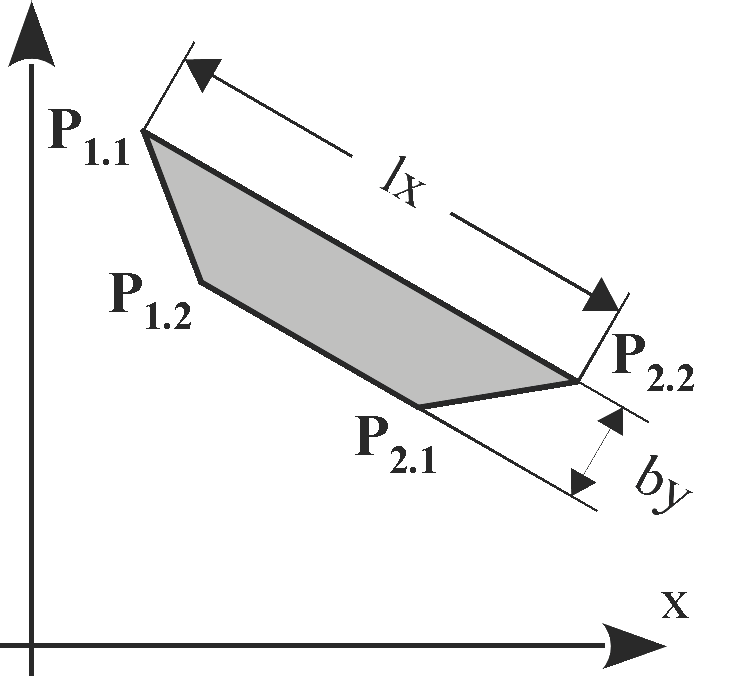</p>

<p><strong>BT6 geometry (large view)</strong></p>
<p></p>

A component can now be additionally identified via a unique identifier, for example, to initiate material orders at upstream machines. The following addition commands can be used directly after defining the component using the commands above. The order is irrelevant and the use of the parameters is optional. 

| Command | Parameters |  Description |
|---	|	---	|		--- |
|MODELLREF | uuid | Globally unique identifier. Required when ordering material at upfront machines. |
|CADMODELLREF | string | Identifier of the component within the originating CAD system. |
|TEILENR | integer | Short identifier for the unique identification of a component within an element. Can be used, for example, for printing. |

---

For the components LS, QS, OG, UG, BT4 and BT6 the parameter [z] was optional up to interface version 3.3.

All data types, with the exception of "name" and "i": floating point number

Data type of i: natural number

Data type of name: character string

All readable characters from the ASCII character set are allowed.

Exceptions:, < > : # $ % = ; ! \ |


---

<h4 id="4.2.2-panels-and-shuttering">4.2.2 Panels t.b.d check: Panel, board, board sheating. Panel means the whole element? ELM</h4>

The start of a panel definition opens a component position. It ends when a new panel definition for a different position starts.

| Command | Parameter sequence | Description |
|:---|:---|:---|
|PLI0 ... PLI10|lx, by, hz, x, y, i, name [, z]|Inside panel in layer 0 to 10. Note: PLI0 is a panel inside the beam layer.|
|PLA0 ... PLA10|lx, by, hz, x, y, i, name [, z]|Outside panel in layer 0 to 10. Note: PLA0 is a panel inside the beam layer.|

Common parameter meaning:

| Parameter | Type | Meaning |
|:---|:---|:---|
|lx|float|Panel length in X direction.|
|by|float|Panel width in Y direction.|
|hz|float|Panel thickness / height in Z direction.|
|x, y|float|Panel insertion position in element coordinates.|
|z|float|Panel Z position. If omitted, value is calculated by layer logic.|
|i|uint|Material index.|
|name|string|Panel name / designation.|

Additional identification commands (optional, directly after PLI/PLA):

| Command | Parameters | Description |
|:---|:---|:---|
|MODELLREF|uuid|Globally unique identifier. Required when ordering material at upstream machines.|
|CADMODELLREF|string|Identifier of the panel in the originating CAD system.|
|TEILENR|integer|Short identifier for unique panel identification within an element.|

Rules and behavior:

| Topic | Rule |
|:---|:---|
|Optional z in older versions|Parameter [z] was optional up to interface version 3.3.|
|Polygon priority|If polygon points are defined for PLI/PLA, polygon geometry has priority over lx/by. The polygon must be closed (first and last point must be identical).|
|Planarity|All polygon points of one panel must lie in exactly one plane (no warped panel).|
|Layer height|If different panel heights exist in one layer, the thickest panel defines the full layer height.|
|Recommendation for mixed thickness|When using mixed panel thicknesses in one layer, define z explicitly for all panels.|
|Very thin panels|Panels with hz <= 1 mm are ignored in offset calculation.|
|Valid polygon outline|The panel outline polygon must not contain self-intersecting lines or coincident (overlapping) lines. A panel with a cutout must be defined using a dedicated PSF blocked-surface polygon, not by connecting the hole to the outer contour via a shared edge. CAD systems that bridge the outer contour to the cutout along the same path (out and back) produce coincident lines that are not permitted.|

Data types and allowed characters:

| Field | Type / Rule |
|:---|:---|
|All numeric fields except i|floating point number|
|i|natural number|
|name|character string|
|Allowed character set in name|All readable ASCII characters except: , < > : # $ % = ; ! \ ||

> Layer height behavior applies retroactively: the thickest panel in a layer defines the layer height.

<p><strong>Panel layer example (large view)</strong></p>
<p></p>
<p>Side view of a timber frame with two panel thicknesses in one layer. Without explicit z, the thickest panel determines the layer height and outer flush surface.</p>

---

<h4 id="4.2.3-unprocessed-parts">4.2.3 Unprocessed parts</h4>

Nesting can be defined using unprocessed parts.

An unprocessed part can contain one or more components of the types LS, QS, OG, UG, BTn. The unprocessed part itself does not carry processing steps.

| Command | Parameter sequence | Description |
|:---|:---|:---|
|RT|lx, by, hz, x, y, z, i, name|Defines one unprocessed part container, followed by component definitions.|
|ENDRT||Ends the unprocessed part definition.|

Common parameter meaning:

| Parameter | Type | Meaning |
|:---|:---|:---|
|lx|float|Total length in X direction.|
|by|float|Total width in Y direction.|
|hz|float|Total height in Z direction.|
|x, y, z|float|Insertion position in element coordinates.|
|i|uint|Material index.|
|name|string|Unprocessed part name / designation.|

Additional identification commands (optional, directly after RT):

| Command | Parameters | Description |
|:---|:---|:---|
|MODELLREF|uuid|Globally unique identifier. Required when ordering material at upstream machines.|
|CADMODELLREF|string|Identifier of the unprocessed part in the originating CAD system.|
|TEILENR|integer|Short identifier for unique identification within an element.|

Rules and behavior:

| Topic | Rule |
|:---|:---|
|Contained component types|LS, QS, OG, UG, BTn are permitted inside RT/ENDRT.|
|Processing steps|The RT container itself does not have own processing steps.|
|Nesting purpose|RT groups multiple components into one unprocessed part for downstream handling.|

Data types and allowed characters:

| Field | Type / Rule |
|:---|:---|
|All numeric fields except i|floating point number|
|i|natural number|
|name|character string|
|Allowed character set in name|All readable ASCII characters except: , < > : # $ % = ; ! \ ||

---

<h4 id="4.2.4-modules">4.2.4 Modules</h4>

Defines prefabricated components, and their processing steps, that are combined into an assembly.

| Command | Parameter sequence | Description |
|:---|:---|:---|
|MODUL|lx, by, hz, x, y, name [, z]|Defines one assembly container, followed by components and their processing steps.|
|ENDMODUL||Ends the assembly definition.|

Common parameter meaning:

| Parameter | Type | Meaning |
|:---|:---|:---|
|lx|float|Module length in X direction.|
|by|float|Module width in Y direction.|
|hz|float|Module height in Z direction.|
|x, y|float|Module insertion position in element coordinates.|
|z|float|Module Z position, default 0.|
|name|string|Module name / designation.|

Additional identification commands (optional, directly after MODUL):

| Command | Parameters | Description |
|:---|:---|:---|
|MODELLREF|uuid|Globally unique identifier. Required when ordering material at upstream machines.|
|CADMODELLREF|string|Identifier of the module in the originating CAD system.|
|TEILENR|integer|Short identifier for unique identification within an element.|

Rules and behavior:

| Topic | Rule |
|:---|:---|
|Coordinate system|Components and processing steps inside a module refer to an element coordinate system with origin at the module origin.|
|Content|A module can contain component definitions and related processing steps.|
|Nesting|Definition starts with MODUL and ends with ENDMODUL.|

Data types and allowed characters:

| Field | Type / Rule |
|:---|:---|
|All numeric fields|floating point number|
|name|character string|
|Allowed character set in name|All readable ASCII characters except: , < > : # $ % = ; ! \ ||

---

<h3 id="4.3-spatial-processing-plane">4.3 Spatial processing plane</h3>

The spatial processing plane defines a new coordinate system.

| Command | Parameter sequence | Description |
|:---|:---|:---|
|RBE2|e, x, y, z, alpha, gamma, delta|Defines a spatial processing plane and a transformed coordinate system.|
|ENDRBE2||Ends the spatial processing plane definition.|

Common parameter meaning:

| Parameter | Type | Meaning |
|:---|:---|:---|
|e|uint|Reference plane. Component processing: 1 to 6; panel processing: 2.|
|x, y, z|float|Origin position of the transformed coordinate system.|
|alpha|float|Rotation around Z axis (first rotation).|
|gamma|float|Tilt around transformed X' axis (second rotation).|
|delta|float|Rotation around transformed Z'' axis (third rotation).|

Rules and behavior:

| Topic | Rule |
|:---|:---|
|Data types|All parameters are floating point except e (natural number).|
|Combinable processing steps|RBE2 can be combined with PAF and PZF|
|Scope of transformed system|Processing steps inside one RBE2/ENDRBE2 block refer to the transformed coordinate system of that block.|
|Nesting|RBE2 nesting is generally possible; currently one nesting level is supported.|
|Panel/layer special case|For panel and layer processing, parameter e is ignored; x, y, z are interpreted in element coordinates.|
|Transformation order|Translations (x, y, z) are applied before rotations. Rotation order: alpha, then gamma, then delta.|
|Angle dependency|delta depends on gamma; gamma depends on alpha.|
|Rotation direction|Positive direction is mathematically positive (counter-clockwise when viewing along the axis toward the origin).|
|Depth sign convention|Depth of eroding operations must be positive and acts counter to the transformed Z'' axis.|
|Length/width direction|Length values refer to transformed X'' axis; width values refer to transformed Y'' axis.|

---

<h3 id="4.4-operations">4.4 Operations</h3>

<h4 id="4.4.1-component-processing-steps">4.4.1 Component processing steps</h4>

Component processing steps can be applied to: UG, OG, LS, QS, BT4, BT6, BTn, RT.

| Command | Parameter sequence | Description |
|:---|:---|:---|
|SG|x, y, z, alpha, gamma, h, e, i [, beta [, s]]|Saw cut as an infinite cutting plane in the component context.|
|KN|x, e, txt [, y [, z [, i]]]|Text labeling at a defined position.|
|MPL|xa, ya, xe, ye, i, e|Marking line by start/end points.|
|PML|e|Marking line with subsequent polygon points.|
|PAF|e [, i [, T]]|Polygon trimming / countersinking with subsequent polygon points.|
|PSG|e [, T]|Polygon saw cut with subsequent polygon points (PP only).|
|PZF|e|Start of a tenon joint with subsequent polygon points.|
|SZ|x, l|Blocked zone on plate components.|
|REFKER|x, txt [, e]|Standard notch for roofing parts. The optional reference plane `e` specifies on which component plane the REFKER contour is defined.|
|PAL|e [, T]|Application line with subsequent polygon points (PP).|

Common parameter meaning:

| Parameter | Type | Meaning |
|:---|:---|:---|
|x, y, z|float|Position in the active coordinate system. (depends on e) |
|xa, ya|float|Start point of a line.|
|xe, ye|float|End point of a line.|
|h|float|Saw depth for SG, perpendicular to the reference plane.|
|e|uint|Reference plane. For component processing typically 1 to 6.|
|i|uint|Control code.|
|T|uint|Tool number, default 0 (machine selects tool).|
|txt|string|Text label (max. 40 characters).|
|l|float|Length of blocked zone SZ.|
|alpha, beta, gamma|float|Angles for rotation, gradient, and tilt depending on command.|

SG-specific rules:

| Topic | Rule |
|:---|:---|
|Reference planes|e = 1 to 6.|
|Correction in control code i|1 = positive correction relative to X axis, 2 = negative correction relative to X axis, 3 = no correction. For planes 5 and 6, correction is relative to Y axis.|
|Optional beta|Gradient angle in cutting surface, default 0.|
|Optional s|s = 0 relative to reference edges (default), s = 1 relative to cutting surfaces.|
|Geometry interpretation|SG defines a half-plane. Use PSG for explicit point-to-point saw paths.|

Fixed Y/Z values by SG reference plane (implementation note):

| Reference plane | Y value | Z value |
|:---|:---|:---|
|E1|width|height|
|E2|0|height|
|E3|0|0|
|E4|width|0|
|E5|free (not fixed)|free (not fixed)|
|E6|free (not fixed)|free (not fixed)|

Note: The fixed-value rule for Y/Z is mandatory for E1 to E4. For E5 and E6, Y and Z are not fixed by this rule and are defined by the actual processing position on the selected reference plane.

PAF and PSG behavior:

| Topic | Rule |
|:---|:---|
|PAF trimming control i|0 = machine default, 1 = no trimming, 2 = trimming.|
|Behavior change since 3.4|From version 3.4, trimming behavior is controlled by PAF parameter i.|
|PSG polygon points|Only PP points are permitted.|
|PSG limitation|PSG must not split a component longitudinally.|

Character rules for KN and REFKER text:

All readable ASCII characters are allowed except: , < > : # $ % = ; ! \ |

Note: Tool number T = 0 means automatic machine tool selection.

REFKER note:

- REFKER is not a machining operation.
- The optional reference plane `e` specifies on which component plane the REFKER contour is defined. If omitted, the default plane applies.
- The assigned plane `e` is not considered in offset calculation.
- REFKER must be defined on every component that is intersected by the REFKER contour. It is not sufficient to define it on one component only.
- t.b.d. (wupEditor): Improve visualization of REFKER in the wupEditor.

---

<h4 id="4.4.2-panel-processing-steps-shuttering-processing">4.4.2 Panel processing steps</h4>

Panel processing steps can be applied to PLI and PLA definitions.

Execution direction is counter to the panel Z axis.

| Command | Parameter sequence | Description |
|:---|:---|:---|
|PAF|[e [, i [, T]]]|Polygon trimming / countersinking for panel processing.|
|PSG|[e [, T]]|Polygon saw cut for panel processing (PP only).|
|NR|xa, ya, xe, ye, a, i|Nail line definition.|
|NBR|x, y, i|Relative nail pattern point, only valid after NR.|
|PSF||Blocked surface polygon for nailing/stapling exclusion. Polygon must be closed.|
|PSZ||Protected zone polygon (obstacle definition). Polygon must be closed. Initially describes only one obstacle within one layer.|
|PML||Marking line with subsequent polygon points.|
|PAL|[e [, T]]|Application line with subsequent polygon points (PP).|
|KN|x, txt, y, z, i|Panel labeling.|

Panel-specific defaults and restrictions:

| Topic | Rule |
|:---|:---|
|Default reference plane|e defaults to 2 for panel processing.|
|PAF trimming control i|0 = machine default, 1 = no trimming, 2 = trimming.|
|Tool number T|Default 0 means machine selects tool.|
|PSG polygon points|Only PP points are permitted.|
|PSF and PSZ polygon closure|Polygon must be closed.|
|PSF and PSZ point types|Only PP-PP sequences and MP are allowed.|
|PSZ interpretation note|PSZ describes initially only one obstacle within one layer.|
|NBR usage|NBR is only valid in combination with NR.|
|NR nail points (mandatory note)|For nail points, start and end must be congruent (xa = xe and ya = ye).|
|NR recommendation|Nail points should always be defined with xa = xe, ya = ye, and a = 1.|
|NR with coincident start/end|If xa = xe and ya = ye, spacing a is ignored (irrelevant).|
|NR conflict rule|If spacing and start/end definition conflict, spacing a takes precedence. For NR with non-resolving spacing, spacing a wins.|

Character rules for KN text:

All readable ASCII characters are allowed except: , < > : # $ % = ; ! \ |


---

<h4 id="4.4.3-units">4.4.3 Units</h4>

Logical grouping of one or more processing steps.

| Command | Parameters | Description |
|:---|:---|:---|
|UNIT|name|Starts a processing group. Step order in the file does not necessarily define machine execution order.|
|ENDUNIT||Ends the processing group.|

Rule: The character @ is reserved for internal use and should not be used in UNIT names.


---

<h4 id="4.4.4-external-nc-programs">4.4.4 External NC programs</h4>

The keyword NC is removed in interface version 3.7 and must no longer be used.


---

<h4 id="4.4.5-assignment-of-signs-for-trimming-and-drilling">4.4.5 Assignment of signs for trimming and drilling</h4>

Depth for eroding processing is specified using positive values.

Exception: withdrawn processing steps may use different legacy conventions.

In general, processing acts counter to the Z axis of the active plane coordinate system.


---

<h3 id="4.5-attributes-properties">4.5 Attributes, properties</h3>

Attributes and properties of structural elements are defined by keyword PROPERTY.

PROPERTY may be used multiple times and must follow directly after the component or processing step it belongs to.

Applicable scope:

- All component definitions from section 4.2
- All processing step definitions from section 4.4

| Command | Parameter sequence | Description |
|:---|:---|:---|
|PROPERTY|n, w|Assigns one property name/value pair to the preceding element.|

Common parameter meaning:

| Parameter | Type | Meaning |
|:---|:---|:---|
|n|string|Property name.|
|w|number or string|Property value. String values are enclosed in double quotes.|

Rules and behavior:

| Topic | Rule |
|:---|:---|
|Placement|PROPERTY must be placed directly after the referenced component or processing step.|
|Multiplicity|Multiple PROPERTY lines are allowed for one referenced element.|
|Machine behavior|Interpretation is machine-specific; consult machine manufacturer documentation.|
|Volume for insulation panels|If a panel is used as insulation and the blow-in volume must be specified, use PROPERTY with name "Volume" and set value w to the required volume in cubic meters (m3).|
|Reserved names|Use of reserved names can cause unintended machine behavior.|

Reserved PROPERTY names (incomplete WEINMANN list):

"Count", "ProducedCount", "SingleMemberNumber", "StackSize", "Group", "Package", "Storey", "StoreyType", "Designation", "Annotation", "AssemblyNumber", "OrderNumber", "Volume", "UserAttribute:Process", "UserAttribute:ELB"


---

<h3 id="4.6-polygon-paths">4.6 Polygon paths</h3>

Polygon definitions are used to define contours and geometry-dependent processing paths.

| Command | Parameter sequence | Description |
|:---|:---|:---|
|PP|x, y, t, i, alpha, z|Polygon point / line segment endpoint.|
|KB|x, y, r, type, t, i, alpha, z|Arc endpoint with arc radius and arc type.|
|MP|xm, ym, r, t, i, zm|Circle center point.|
|TA|lx, by, xm, ym, z, t, r, alpha, delta, i|Pocket element for internal trimming geometry.|

<p><strong>TA pocket geometry (large view)</strong></p>
<p>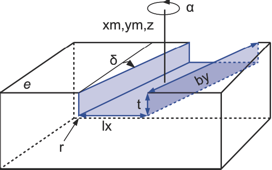</p>

Common parameter meaning:

| Parameter | Type | Meaning |
|:---|:---|:---|
|x, y, z|float|Point position in active coordinate system.|
|xm, ym, zm|float|Center-point position.|
|t|float|Depth, counter to Z axis of reference plane at the current point.|
|i|uint|Control code.|
|alpha|float|Tilt angle at point / segment.|
|r|float|Radius (arc or circle depending on element).|
|type|string|Arc type for KB (Acw, Acc, ACW, ACC).|
|lx, by|float|Pocket side lengths for TA.|
|delta|float|Pocket shear angle for TA.|

Rules and behavior:

| Topic | Rule |
|:---|:---|
|Permitted base combinations|PP followed by PP/KB; KB requires preceding PP/KB; MP or TA as single element.|
|Path closure|Polygon paths do not need to be closed unless required by the calling command.|
|Version availability|Polygon points available since 3.2; z ordinates mandatory since 3.4 (except panel outline / blocked surface exceptions).|
|Interpolation|Non-interpolable attributes are taken from the end point of each line/arc segment.|
|Allowed usage PP/KB/MP|Can be used with PAF, PZF, PSF and with component geometries PLI-x, PLA-x, BTn.|
|Allowed usage TA|TA is only valid in context of PAF processing.|
|PROPERTY placement|PROPERTY must be inserted between the command keyword and PP/KB/MP/TA when used.|
|PP in special contexts|For panel outlines or blocked surfaces, x and y can be sufficient. For PAL, depth t must be 0.|

Data types and allowed values:

| Field | Type / Rule |
|:---|:---|
|All numeric fields except i|floating point number|
|i|natural number|
|type|string: Acw (CW <= 180 deg), Acc (CCW <= 180 deg), ACW (CW > 180 deg), ACC (CCW > 180 deg)|

---

<h2 id="5-material-index-installation-position">5 Material index, installation position</h2>

<h3 id="5.1-installation-position-of-ug-og-ls-qs-ebt">5.1 Installation position of UG, OG, LS, QS, EBT</h3>

The identification of the installation position via the material index is used in conjunction with automatic storage. It can be used to control the material flow through the machine.


|  |  |   
|:---	|	:---	|	
|The ones position in the material index defines the installation position. |0: Normal|
||1: Flat and flush to the external side|
||2: Flat and flush to the internal side|
||3: flat in the center of the wall|


The definition of the Z position takes precedence over the installation position. 

Recommendation: Prefer explicit z values. If z values conflict with index-based installation/rotation information, z values take precedence.

The evaluation of the ones position is being withdrawn.


|  |  |   
|:---	|	:---	|	
|The tens position in the material index defines the rotation around the longitudinal axis of the compo- nent.|0: Not rotated|
||1: rotated by 90°|
||2: rotated by 180°|
||3: rotated by 270°|


If the rotation and alignment are specified, the rotation takes effect before the alignment.

Different materials have different values in the hundreds position of the material index.

Example: Traverse studs, INNEN view

<p>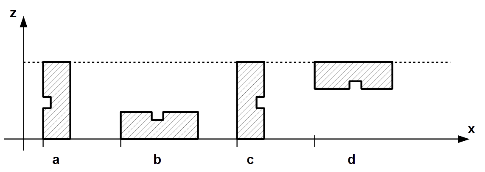</p>
Definition i = 11 i = 20 i = 32


---

<h3 id="5.2-material-indices-for-components">5.2 Material indices for components</h3>

Different materials have different values in the hundreds position of the material index.

The numerical values 0-9900 can be used as required.

The numerical values from 10000 to 29900 and from 32700 are reserved for internal purposes.


---

<h3 id="5.3-material-indices-for-panels-and-shuttering">5.3 Material indices for panels and shuttering</h3>

The material index identifies the type of panel.

Note: The following material index list is a recommendation. It can be adjusted by agreement with the machine manufacturer. In practice, customers may use more than 10 different indices within one material type.

|Material  | Index |   
|:---	|	:---	|
|Wood component |01-09|
|Plaster phases (Fermacell) |10-19|
|Soft fiber panel (Gutex, ...) |20-29|
|OSB (Oriented Strand Board) |30-39|
|Chipboard| 40-49|
|Plaster-base sheeting |50-59|
|Plaster |60-69|
|Gypsum plasterboard |70-79|
|Plastic panel |80-89|
|Plywood panel |90-99|
|Plaster |100-109|
|Shuttering |110-119|
|Three-layer panel| 120-129|
|Glue |130-139|
|Insulating plate (Diffutherm)| 140-149|
|Insulating plate (Heraklith) |150-159|
|Planks |160-169|
|Adhesive tape |170-179|
|Film/vapor block |180-189*|
|Plywood panel |190-199|
|Hardboard |200-209|
|Profiled panel 1) |210-219|
|Porous concrete| 220-229|
|Cavity insulation: cellulose |230-239|
|Cavity insulation: soft wood fiber |240-249|
|Cavity insulation: mineral wool |250-259|
|Cavity insulation: fiberglass t.b.d. chs: ist auch Mineralwolle |260-269|


*Components in this index range have no influence on the offset and length calculation. 
The same applies for panels and shuttering with a thickness of 1 mm or less.

1) For example, trapezoidal or sinusoidal sheets

 ---

<h3 id="5.4-control-codes-for-components">5.4 Control codes for components</h3>

<h3 id="5.4.1-control-codes-for-panels-with-defined-polygon-points">5.4.1 Control codes for panels with defined polygon points</h3>

The following control codes allow for more precise specification of a panel, for example, to represent tongue/groove. As a prerequisite for using the control codes, the panel must be defined using polygon points PP.

The control code cannot be interpolated. The reference point is therefore always the end point of a partial section of a polygon path.
  
|Control code  | Panel meaning  |
|:---	|	:---	|
|1 ... 9 |Depth in mm (ones digit) |
|00 ... 90 |Depth in ten mm steps (tens digit)|
|100 | Tongue |
|200 | Groove |

The defined polygon points further define the base of the panel, i.e. the tongue extends over this defined surface with the specified depth, while the groove extends into the defined base.

> **Note:** A tongue increases the overall dimensions of the panel. The polygon points define the base geometry of the panel; the tongue protrudes beyond this base by the specified depth, thus enlarging the total panel size accordingly.

<p>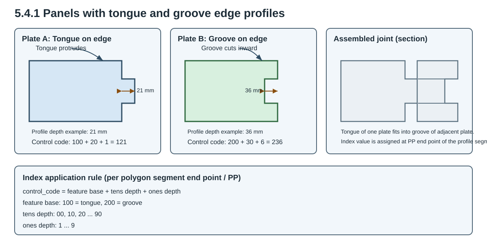</p>

Example:

A panel with a tongue on one side that protrudes 21mm: 1mm depth (1) + 20mm depth(2) + Tongue (100) results in a control code of 121. 

Index application rule (set at the end point of each polygon partial section / PP):

Control code = feature base + tens depth + ones depth

- feature base: 100 = tongue, 200 = groove
- tens depth: 00, 10, 20 ... 90
- ones depth: 1 ... 9

Second example (groove):

A groove with 36mm depth is encoded as 200 + 30 + 6 = 236.


---

<h2 id="6-control-codes-for-processing-steps">6 Control codes for processing steps</h2>

<h3 id="6.1-sawing-and-polygon-trimming">6.1 Sawing and polygon trimming</h3>

The following control codes are used to control the saw or trimming unit.

  
|Control code  |PAF meaning  | PSG meaning  |
|:---	|	:---	|	:---	|	
|1 |Cylindrical trimmer |Standard saw blade|
|2 |Trimmer with chamfer |Fine-toothed saw blade|
|3 |Trimmer for horizontal groove Chainsaw|
|4 |Vertical marking trimmer||
|5...9| Free| Free|
|10 |Overcutting trimming line |Overcutting cut|
|20| Undercutting trimming line |Undercutting cut|
|30...90| locked|


|  |  |   
|:---	|	:---	|	
|100 |Tool radius correction "left" Workpiece is located to the right of the processing line|
|200 |Tool radius correction "right" Workpiece is located to the left of the processing line|
|300 |Tool radius correction "middle" Workpiece is located to the middle of the processing line -> No tool radius offset|
|400...900| locked|
|1000...9000| locked|


**Note**

The ones and thousands position of the control code cannot be interpolated. 
The reference point is therefore always the end point of a partial section of a polygon path.


Example:

Cylindrical trimmer (1) + overlapping (10) + tool radius correction to the right (200) + reverse rotation (0000) results in a control code of 211.


---

<h4 id="6.1.1-tool-category">6.1.1 Tool category</h4>

The ones position in the control code determines the tool category.

See the table under 6.1.


---

<h4 id="6.1.2-undercut-and-overcut">6.1.2 Undercut and overcut</h4>

The tens position in the control code determines the overcut and undercut.

Overcut: control code: xx1x

<p></p>

Undercut: control code: xx2x

<p></p>


---

<h4 id="6.1.3-tool-radius-correction">6.1.3 Tool radius correction</h4>

The hundreds position in the control code determines the tool radius correction.

**Note** The reference for the tool radius correction is the processing direction.

**Caution**

Tool radius correction is defined from one fixed viewing side (Ansichtsseite). This interpretation must be used consistently. If the viewing side is changed, the meaning of left/right is mirrored.

View-side interpretation example:

| Situation (view side fixed) | Radius correction | Meaning |
|:---|:---|:---|
|Workpiece must remain on the right side of the processing line|100|Tool radius correction left|
|Workpiece must remain on the left side of the processing line|200|Tool radius correction right|
|No side offset requested|300|No tool radius correction (middle)|


***No tool radius correction (control code 300)***
Bearbeitungsrichtung
<p></p>


With control code 300, no differentiation between material waste and a required part is possible.


***Tool radius correction in the processing direction to the left (control code 100)***
Bearbeitungsrichtung
<p>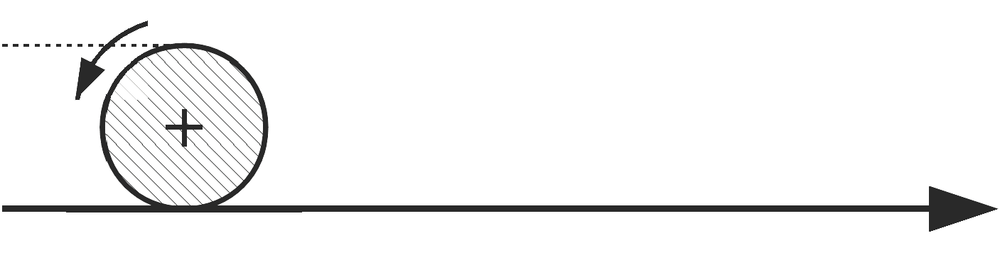</p>


The material waste is located on the side of the chipping processing unit.


***Tool radius correction in the processing direction to the right (control code 200)***
Bearbeitungsrichtung 
<p>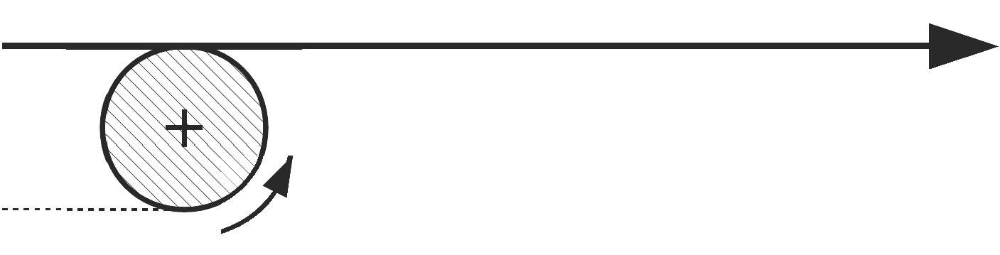</p>

The material waste is located on the side of the chipping processing unit.


---

<h4 id="6.1.4-synchronous-and-reverse-rotation">6.1.4 Synchronous and reverse rotation</h4>

The thousands position of the control code specifies synchronous or reverse rotation for the processing steps. See the table under 6.1.


---

<h4 id="6.1.5-examples">6.1.5 Examples</h4>

|  |  |   
|:---	|	:---	|	
|Circular notch in a clockwise direction PAF MP 3382,40,34,18,211;|<p>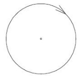</p>|
|Closed, rectangular notch <ul><li>PAF</li><li>PP 65,2201,34,121,0;</li><li> PP 133,2201,34,121,0; </li><li>PP 133,2269,34,121,0; </li><li>PP 65,2269,34,121,0;</li><li> PP 65,2201,34,121,0;</li></ul>|<p></p>|
|Notch with arc <ul><li>PAF</li><li> PP 2000,0,16,211,0; </li><li>PP 2000,1800,16,211,0;</li><li> KB 3000,1800,800,</li><li>Acw,16,211,0;</li><li> PP 3000,0,16,211,0;</li></ul>|<p></p>|


---

<h3 id="6.2-pocket-trimming">6.2 Pocket trimming</h3>

The trimming unit is activated via control codes.

| Control code  | Meaning |   
|:---	|	:---	|	
|0| Overcut/undercut according to the machine rules|
|1| Overcut|
|2 |Undercut|

**Note**

The specification for overcut or undercut refers to all four corners of a pocket.


---

<h3 id="6.3-highlight">6.3 Highlight</h3>

The activation of the marking unit for MPL and PML processing is via control codes.

| Control code  | Meaning |   
|:---	|	:---	|	
|1 |Inkjet printer|
|2 |Ballpoint pen|
|3 |Marking awl|
|10 |Marking on the opposite plane|
|20 |Marking on the definition plane/layer|
|100 |Line color: black|
|200| Line color: blue|
|300 |Line color: green|


**Note** The control codes cannot be interpolated. They are therefore always based on the end point of a partial section of a polygon path.

Example:

Black line with ballpoint pen on panel: 122

---

<h3 id="6.4-application-line">6.4 Application line</h3>

The activation of the application unit for PAL processing is via control codes.


| Control code  | Meaning |   
|:---	|	:---	|	
|1| Sealing tape 60 mm|
|2 |Sealing tape 50 mm|
|3 |Gluing|
|4...9| Free|
|100 |Tool radius correction "left" Workpiece is located to the right of the processing line.|
|200 |Tool radius correction "right" Workpiece is located to the left of the processing line|
|300| No tool radius offset|
|400...900 |locked|

**Note** The control codes cannot be interpolated. They are therefore always based on the end point of a partial section of a polygon path.


Example:

50 mm sealing tape with tool radius correction to the left on the panel: 102


---

<h3 id="6.5-polygon-bocked-surfaces">6.5 Polygon bocked surfaces</h3>

The control code of a blocked surface qualifies the blocked surface for:

| Control code  | Processing class |   
|:---	|	:---	|	
|0| Fixtures|
|1| Gluing|
|2| Plastering|
|3| Application line|


---

<h2 id="7-angles-and-radii">7 Angles and radii</h2>

<h3 id="7.1-rotation-and-tilt-angle-of-spatial-processing-plane-rbe2">7.1 Rotation and tilt angle of spatial processing plane RBE2</h3>

Starting from the image under 2.3.5, the transformation from Figure a.) to Figure b.) arises through the positive angle.

The transformation from b.) to c.) arises through the positive angle.

A positive angle δ would rotate the plane from Figure c.) around the already transformed Z" axis again.


---

<h3 id="7.2-rotation-tilt-and-gradient-angle-of-the-saw-cut-sg">7.2 Rotation, tilt, and gradient angle of the saw cut SG</h3>


---

<h4 id="7.2.1-saw-cut-without-gradient-angle">7.2.1 Saw cut without gradient angle</h4>

<p>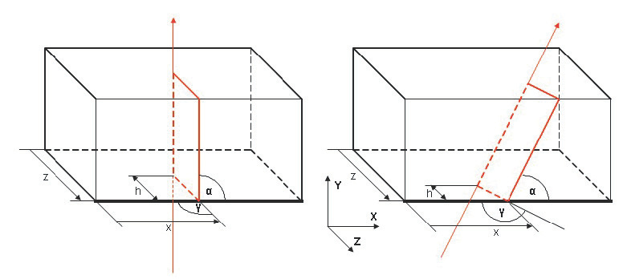</p>

| |  |   
|:---	|	:---	|	
|6.1| Sawing line |
|6.2 |Reference edge |
|6.3 |Reference plane|


Please note:

The tilt angle relates to edges or surfaces depending on the value of the s bit.

See definition of the saw cut.


---

<h4 id="7.2.2-saw-cut-with-gradient-angle">7.2.2 Saw cut with gradient angle</h4>

<p>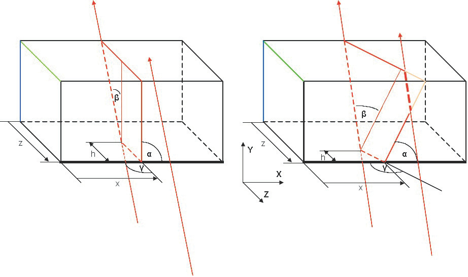</p>

| |  |   
|:---	|	:---	|	
|6.1 |Sawing line|
|6.2 |Reference edge|
|6.3| Reference plane |
|6.4 |Line of the saw blade axis|


Please note:

In the reference drawing, the gradient angle β has a positive numerical value.

LS 4519.4,100,200,0,0,10000,valley jack rafter left,0;

SG 500,0,200,90.000,90.000,100,2,2,40.000,1;


---

<h3 id="7.3-tilt-angle-for-polygon-points-pp-kb-and-mp">7.3 Tilt angle for polygon points PP, KB, and MP</h3>

The tilt angle of a polygon point always references to the tangent of the processing line in the processing direction at this point.

If two sequential polygon points have different tilt angles, the tilt angle between the two points is interpolated linearly.

Positive tilt angle: clockwise in the direction of the processing line

<p>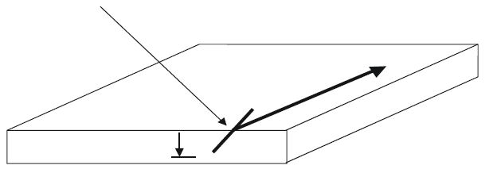</p>


Negative tilt angle: counter-clockwise in the direction of the processing line

<p>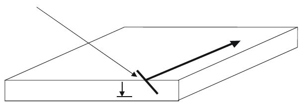</p>

---

<h3 id="7.4-radius-for-polygon-point-mp">7.4 Radius for polygon point MP</h3>

If the radius is specified as a positive value, an arc is processed in a clockwise direction.

If the radius is specified as a negative value, an arc is processed in a counterclockwise direction.

The data is based on a consideration counter to the Z axis of the relevant coordinate system.

<p></p>

---

<h2 id="8-examples">8 Examples</h2>

<h3 id="8.1-example-file-header">8.1 Example file header</h3>

```text
TXT Created by the wupEditor;
VERSION 3.7;
ELEMENTID e0dbd9dc-4057-4223-b7bf-78f9976f9953;
CADDOCUMENTID 9976f995;
ANR Order 1834;
ELB GABLE;
ELN gi003686;
ZNR 4921;
ELM 8144, 2852, 192, 1;
CAD wupEditor;
CADRELEASE 2026.01a;
BEARBEITER Max Mustermann;
BAUVORHABEN Greystar Great Valley;
KUNDENNAME Max Mustermann;
OBJEKT Bldg 2000;
ORT BP;
```

<h3 id="8.2-example-components">8.2 Example: components</h3>

Upper beam

```text
OG 8932,80,80,0,2520,0,top plate,0;
```

Upper beam with reference

```text
OG 8932,80,80,0,2520,0,top plate,0;
MODELLREF 804f85ea-d32a-4096-810f-f9d95cece7fa;
CADMODELLREF f9d95cece7fa;
TEILENR 1;
```

Bottom plate (threshold)

```text
UG 8932,80,80,0,0,0,bottom plate,0;
```

Cross beam

```text
QS 2440,80,80,0,80,0,stud-W,0;
```

Horizontal beam

```text
LS 890,60,80,4210,2100,0,head,0;
```

Component with 4 corner points

```text
BT4 2440,165,80,2375,80,2540,80,2540,2339,2375,2520,0,stud-S,0;
```

Component with 6 corner points

```text
BT6 2440,165,80,2375,80,2458,80,2540,80,2540,2339,2459,2520,2375,2520,0,stud-S,0;
```

Built-in part

```text
EBT 890,60,80,4210,2100,1,iron girder,0;
```

<h3 id="8.3-example-of-panels">8.3 Example of panels</h3>

Panel, layer 1, inside

```text
PLI1 643,2600,15,6251,0,40,chipboard,0;
PP 6251,0,15,0,0,0;
PP 6894,0,15,0,0,0;
PP 6894,2600,15,0,0,0;
PP 6251,2600,15,0,0,0;
PP 6251,0,15,0,0,0;
```

Panel, layer 1, inside, Tongue and Groove

```text
PLI1 643,2600,15,6251,0,40,chipboard,0;
PP 6251,0,15,0,0,0;
PP 6894,0,15,221,0,0;
PP 6894,2600,15,0,0,0;
PP 6251,2600,15,0,0,0;
PP 6251,0,15,120,0,0;
```

Panel, layer 2, inside

```text
PLI2 643,2600,15,6251,0,40,chipboard,0;
PP 6251,0,15,0,0,0;
PP 6894,0,15,0,0,0;
PP 6894,2600,15,0,0,0;
PP 6251,2600,15,0,0,0;
PP 6251,2600,15,0,0,0;
```

Panel, layer 1, external side

```text
PLA1 643,2600,15,6251,0,40,chipboard,0;
PP 6251,0,15,0,0,0;
PP 6894,0,15,0,0,0;
PP 6894,2600,15,0,0,0;
PP 6251,2600,15,0,0,0;
PP 6251,0,15,0,0,0;
```

Panel, layer 2, external side

```text
PLA2 643,2600,15,6251,0,40,chipboard,0;
PP 6251,0,15,0,0,0;
PP 6894,0,15,0,0,0;
PP 6894,2600,15,0,0,0;
PP 6251,2600,15,0,0,0;
PP 6251,0,15,0,0,0;
```

<h3 id="8.4-example-slats-and-contra-slats">8.4 Example slats and contra slats</h3>

Contra slats

```text
PLA1 2579,70,24,58,0,3,PLA #1,0;
PP 58,0,24,0,0,0;
PP 2637,0,24,0,0,0;
PP 2637,70,24,0,0,0;
PP 58,70,24,0,0,0;
PP 58,0,24,0,0,0;
NR 78,48,2617,48,250,10;
PLA1 5625,70,24,58,867,3,PLA #2,0;
PP 58,867,24,0,0,0;
PP 5683,867,24,0,0,0;
PP 58,937,24,0,0,0;
PP 58,867,24,0,0,0;
NR 78,902,4983,902,250,10;
```

Slat

```text
PLA2 50,2744,38,319,0,PLA #1,0;
PP 319,0,38,0,0,0;
PP 369,0,38,0,0,0;
PP 369,2744,38,0,0,0;
PP 319,2744,38,0,0,0;
PP 319,0,38,0,0,0;
NR 344,48,344,48,1,10;
NBR 0,0,2;
NR 344,1828,344,1828,1,10;
NBR 10,-5,2;
NBR -10,5,2;
NR 344,2729,344,2729,1,10;
NBR 10,10,2;
NBR -10,-10,2;
```

<h3 id="8.5-polygon-paths">8.5 Polygon paths</h3>

Closed polygon path

```text
PAF;
PP 65,2201,34,121,0,0;
PP 133,2201,34,121,0,0;
PP 133,2269,34,121,0,0;
PP 65,2269,34,121,0,0;
PP 65,2201,34,121,0,0;
```

Open polygon path

```text
PAF;
PP 100,0,20,111,0,0;
PP 100,500,20,111,0,0;
PP 200,700,20,111,0,0;
PP 200,1000,20,111,0,0;
PP 500,1000,20,111,0,0;
PP 500,150,20,111,0,0;
```

Polygon path with arc

```text
PAF;
PP 2000,0,16,211,0,0;
PP 2000,1800,16,211,0,0;
KB 3000,1800,800,Acw,16,211,0,0;
PP 3000,0,16,211,0,0;
```

Polygon path for lateral groove

```text
PAF;
PP 40,0,35,113,0,30;
PP 40,1800,35,113,0,30;
```


<p>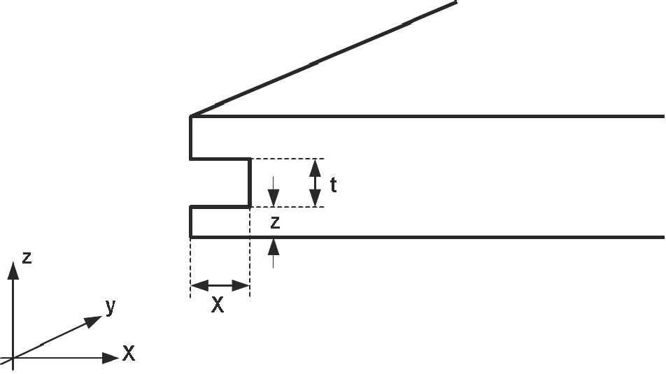</p>

# Todo

* **Befestigerindex hinzufügen**