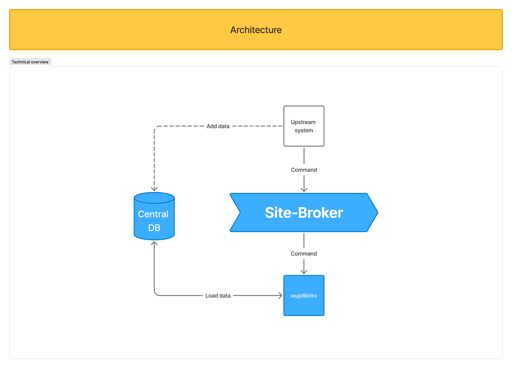
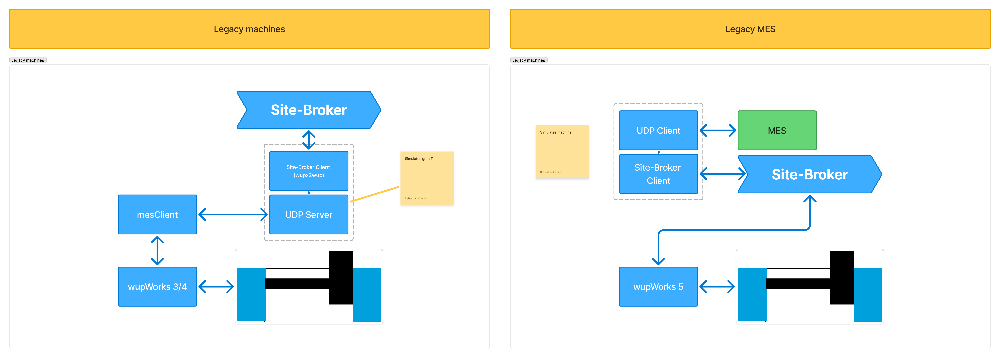

# Site-Broker | Remote Interface — General Concept

> This document describes the **general concept** of the SiteBroker. The exact technical specification (topics, payloads, status enums, API and configuration) lives exclusively in the **[Interface & Method Specification](Interface_Specification.md)**.
>
> See also: [Integration Guide](Integration_Guide.md) · [Demo Applications](Demo_Application.md) · [Manual Workstation Integration](Integration_ManualWorkstation.md).

## General

The SiteBroker is an MQTT broker designed to facilitate communication between software components at the production level—such as machines and wupWorks—and higher-level systems like MES or productionManager.

Its primary purpose is to establish a unified interface for data exchange and remote control of software across the production environment. This standardized interface **replaces the current MES interface**, including for legacy products, ensuring seamless integration and consistent communication protocols.

A key advantage of the SiteBroker is that it enables not only existing systems but also future applications—such as the productionAssist app—to utilize the same communication interface, streamlining interoperability and simplifying system architecture.

## Architecture — MQTT

MQTT (Message Queuing Telemetry Transport) is a lightweight, publish-subscribe messaging protocol designed for efficient, reliable communication in constrained environments, such as industrial automation or IoT systems. It operates over TCP/IP and is optimized for low bandwidth and low power consumption. Technically, MQTT communication involves three main components: clients (publishers and subscribers) and a central broker. Publishers send messages to specific topics on the broker, while subscribers receive messages by subscribing to those topics. The broker manages message distribution, ensuring that subscribers get the relevant data. This decouples message producers and consumers, enabling asynchronous and scalable communication. MQTT supports different Quality of Service (QoS) levels to balance message delivery reliability and performance.

## Architecture — Central Database

In this concept, MQTT is used solely for command and control messaging, not for transmitting payload data. When a relevant MQTT command is received via the SiteBroker, the system triggers a data request to the Central Database, which contains the detailed documents and job structures. The actual data retrieval is performed via REST API calls to the Central Database. This separation ensures that MQTT handles lightweight, real-time control messages while the heavier and more complex data exchanges occur through REST, optimizing network efficiency and maintaining clear responsibility boundaries between messaging and data storage.

## The two roles

The SiteBroker connects an **upstream system** with a **machine**. Conceptually there are two roles; the exact interfaces and methods are specified in the [Interface & Method Specification](Interface_Specification.md#8-net-client-library-api).

| Role | Who plays it | Responsibility |
|------|--------------|----------------|
| **MES / Orchestrator** | MES, productionManager, any upstream system | *Sends* commands to a machine (load order, prepare batch, run batch variant); *receives* the status responses |
| **Machine / Client** | A machine, manual workstation, third-party machine | *Receives* commands; *sends* status responses and the online-mode |

### Design principles

| Principle | Meaning |
|-----------|---------|
| **MQTT for control only** | The broker carries lightweight command/status messages. It does **not** transport documents or job payloads. |
| **REST + Central Database for data** | Bulk data (documents, job structures) is fetched separately via REST from the Central Database. |
| **Decoupled & asynchronous** | Publishers and subscribers never talk directly. A request and its response are independent, retained MQTT messages correlated by id. |
| **Symmetric** | The same topic/payload scheme is used regardless of who is on either end. |

## Deployment scenarios

If only a single machine is present or no networked setup is required, the SiteBroker along with the database is installed directly on the machine. In a distributed scenario, the SiteBroker and database run on a central server, and the machines are configured to connect to this server. In this case, the local machine-level broker is deactivated to avoid conflicts. The different deployment scenarios are illustrated below.

| Scenario | Description |
|---|---|
| **Single Machine** | SiteBroker and database are installed directly on the machine |
| **Distributed System** | SiteBroker and database run on a central server; machines connect to this server; the local machine-level broker is deactivated |

## Legacy systems

Legacy systems are also connected to the SiteBroker, replacing the current MES client. To ensure compatibility with existing MES installations as well as to integrate legacy machines into new MES systems, UDP and REST adapters are used bidirectionally. These adapters facilitate seamless communication between the SiteBroker and legacy components, enabling smooth transition and interoperability across different system generations.

## Glossary

| Term | Meaning |
|------|---------|
| **SiteBroker** | Central MQTT orchestration service; unified interface for production components |
| **Orchestrator** | Upstream system (MES, productionManager); sender of commands |
| **Client / Machine** | Connected workstation (automated machine or manual workstation) |
| **Order / OrderId** | Document and its GUID |
| **Batch / BatchId** | Job and its GUID |
| **BatchVariant / BatchVariantId** | Individual execution instance (run) and its GUID |
| **Retained Message** | MQTT message stored by the broker and delivered immediately to newly connected clients |
| **Online Mode** | Operating state in which the client accepts jobs from the orchestrator |
| **PSLV** | Place/Side/Layer/Variant — format for variant identifiers |
| **Central Database** | REST API database containing documents and job structures (for standard machines) |
