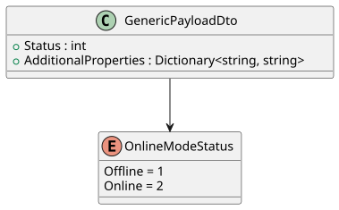
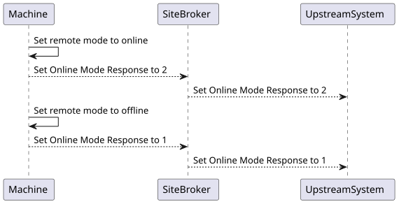
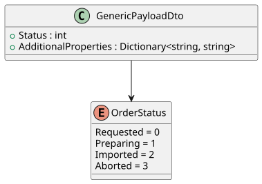
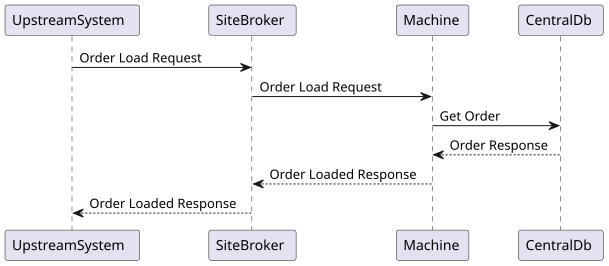
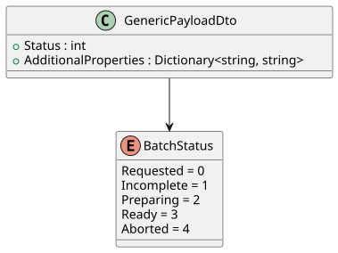
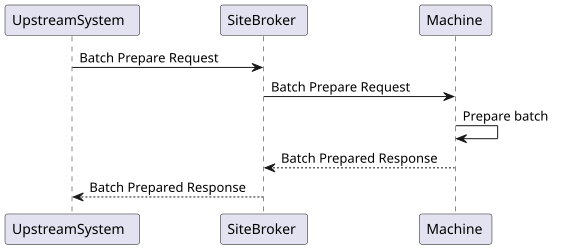
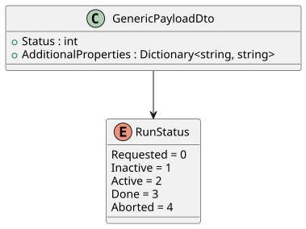
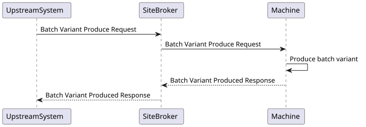
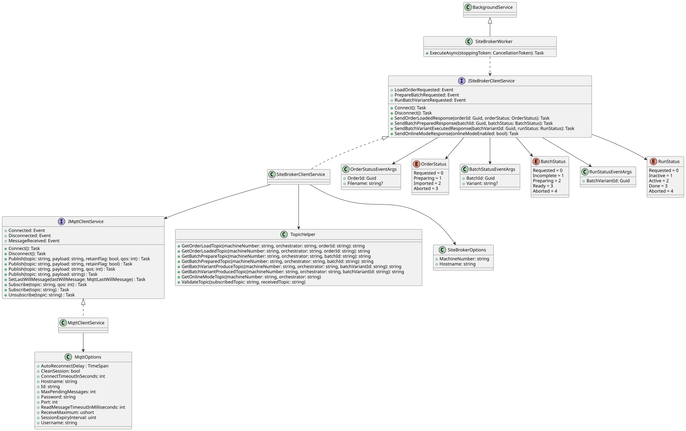

# SiteBroker — Interface & Method Specification

> **Single source of truth.** This document is the *only* place that contains the exact technical specification of the SiteBroker interface — MQTT topics, payloads, status enumerations, message sequences, the .NET client API and the configuration options. All other documents ([General Concept](General_Concept.md), [Integration Guide](Integration_Guide.md), [Demo Applications](Demo_Application.md), [Manual Workstation Integration](Integration_ManualWorkstation.md)) describe *how* and *why* to use the interface and **link back here** for the precise details, so the specification only ever has to be maintained in one place.

---

## Table of contents

1. [Communication protocol (MQTT)](#1-communication-protocol-mqtt)
2. [Topic structure](#2-topic-structure)
3. [Payload format](#3-payload-format)
4. [Status models](#4-status-models)
5. [Online mode](#5-online-mode)
6. [Message reference](#6-message-reference)
7. [Clear mechanism (retained messages)](#7-clear-mechanism-retained-messages)
8. [.NET client library API](#8-net-client-library-api)
9. [Configuration reference](#9-configuration-reference)
10. [Library structure (UML)](#10-library-structure-uml)

---

## 1. Communication protocol (MQTT)

| Property | Value / Description |
|---|---|
| Protocol | MQTT v5 (via [MQTTnet](https://github.com/dotnet/MQTTnet) 4.3) |
| Default Port | 1883 (unencrypted) |
| QoS | ExactlyOnce (2) |
| Retained Messages | Yes — commands and responses are published as retained messages so that a client reconnecting after a restart still receives the last message per topic |
| Clean Session | Configurable (default: `true`) |
| Auto-Reconnect | Yes — with configurable delay |

MQTT is used **exclusively for command-and-control messages**. The actual payload data (documents, job structures) is **not** transmitted over MQTT — it is retrieved separately via **REST API** from the Central Database (see [General Concept](General_Concept.md)).

---

## 2. Topic structure

All MQTT topics follow the pattern:

```
{Sender}/{Receiver}/{Resource}/{ID}/{Action}
```

Direction is encoded in the topic order: **commands** start with the sender, **responses** start with the machine.

| Interaction | Direction | Topic |
|-------------|-----------|-------|
| Load order | Orchestrator → Client | `<Sender>/<MachineNumber>/order/<orderId>/load` |
| Order loaded | Client → Orchestrator | `<MachineNumber>/orchestrator/order/<orderId>/loaded` |
| Prepare batch | Orchestrator → Client | `<Sender>/<MachineNumber>/batch/<batchId>/prepare` |
| Batch prepared | Client → Orchestrator | `<MachineNumber>/orchestrator/batch/<batchId>/prepared` |
| Run batch variant | Orchestrator → Client | `<Sender>/<MachineNumber>/batch-variant/<batchVariantId>/produce` |
| Batch variant produced | Client → Orchestrator | `<MachineNumber>/orchestrator/batch-variant/<batchVariantId>/produced` |
| Online mode | Client → Orchestrator | `<MachineNumber>/orchestrator/settings/online-mode` |

**Placeholders:**
- `<Sender>` — sender of the command (the library uses the fixed literal `orchestrator`).
- `<MachineNumber>` — site-wide **unique** machine identifier, e.g. `HAP-01`.
- `<orderId>`, `<batchId>`, `<batchVariantId>` — GUIDs (UUID v4).

The id is always the **4th path segment** (`topic.Split('/')[3]`) and is used for correlation. The orchestrator subscribes with MQTT wildcards (`+`) for the machine number and id, so a single subscription receives responses from all machines.

---

## 3. Payload format

All payloads are transmitted as JSON. The unified envelope is `GenericPayloadDto`:

```jsonc
{
  "Status": 0,                       // integer status (see §4)
  "AdditionalProperties": {          // optional string→string map of extra fields
    "OrderId": "00000000-0000-0000-0000-000000000000"
  }
}
```

### Known `AdditionalProperties` keys

| Key | Usage |
|---|---|
| `"Filename"` | File name (legacy import, optional) |
| `"Variant"` | PSLV variant (see below) |
| `"OrderId"` | Document ID — in responses and in the `produce` payload for the manual workstation |
| `"BatchId"` | Job ID — in the `prepared` response |
| `"BatchVariantId"` | Execution ID — in the `produced` response |

### PSLV format (Variant)

The variant identifier follows the **PSLV** schema (Place / Side / Layer / Variant) and identifies the layer or side of a document to be executed. Example: `External-1`.

---

## 4. Status models

All status enums are serialized as their **integer** value in `Status`.

### OrderStatus

| Value | Name | Meaning | Terminal |
|------:|------|---------|:--------:|
| 0 | `Requested` | Command sent, not yet processed | |
| 1 | `Preparing` | Machine is importing the document | |
| 2 | `Imported` | Order successfully loaded | ✅ |
| 3 | `Aborted` | Order load failed/cancelled | ✅ |

*Allowed status values in the `loaded` response: 1–3 (`Preparing`, `Imported`, `Aborted`).*

### BatchStatus

| Value | Name | Meaning | Terminal |
|------:|------|---------|:--------:|
| 0 | `Requested` | Command sent | |
| 1 | `Incomplete` | Missing data / not ready | |
| 2 | `Preparing` | Being prepared | |
| 3 | `Ready` | Batch prepared | ✅ |
| 4 | `Aborted` | Prepare failed/cancelled | ✅ |

*Allowed status values in the `prepared` response: 1–4 (`Incomplete`, `Preparing`, `Ready`, `Aborted`).*

### RunStatus

| Value | Name | Meaning | Terminal |
|------:|------|---------|:--------:|
| 0 | `Requested` | Command sent | |
| 1 | `Inactive` | Not running / paused | |
| 2 | `Active` | Production running | |
| 3 | `Done` | Variant produced | ✅ |
| 4 | `Aborted` | Run failed/cancelled | ✅ |

*Allowed status values in the `produced` response: 1–4 (`Inactive`, `Active`, `Done`, `Aborted`).*

### OnlineModeStatus

| Value | Name |
|------:|------|
| 1 | `Offline` |
| 2 | `Online` |

> **Terminal vs. intermediate.** A consumer should treat the terminal states (✅) as "request finished". Any further status with the same id after a terminal state is a late / duplicate message. Failure is always reported **in-band** as the `Aborted` terminal status, never as an exception.

---

## 5. Online mode

**Online mode** is a prerequisite for the client to process `PrepareBatch` and `ExecuteBatchVariant` commands. The client actively publishes its online-mode status (retained) to the orchestrator.

**Topic (Client → Orchestrator):** `<MachineNumber>/orchestrator/settings/online-mode`

```json
{ "Status": 2, "AdditionalProperties": {} }
```
*(Status 2 = Online, Status 1 = Offline)*

```
Machine -> Machine: Set remote mode to online
Machine -> SiteBroker: OnlineMode Response = 2
SiteBroker -> Upstream System: OnlineMode Response = 2

Machine -> Machine: Set remote mode to offline
Machine -> SiteBroker: OnlineMode Response = 1
SiteBroker -> Upstream System: OnlineMode Response = 1
```





<details>
<summary>PlantUML</summary>

```
@startuml
Machine -> Machine: Set remote mode to online

SiteBroker <-- Machine: Set Online Mode Response to 2
UpstreamSystem <-- SiteBroker: Set Online Mode Response to 2

Machine -> Machine: Set remote mode to offline

SiteBroker <-- Machine: Set Online Mode Response to 1
UpstreamSystem <-- SiteBroker: Set Online Mode Response to 1
@enduml
```
</details>

---

## 6. Message reference

### 6.1 Load order

**Command (Orchestrator → Client)** — Topic: `<Sender>/<MachineNumber>/order/<orderId>/load`

```json
{
  "Status": 0,
  "AdditionalProperties": { "Filename": "xyz.wup" }
}
```
*`Filename` is optional and only required for legacy use cases.*

**Response (Client → Orchestrator)** — Topic: `<MachineNumber>/orchestrator/order/<orderId>/loaded`

```json
{
  "Status": 2,
  "AdditionalProperties": { "OrderId": "550e8400-e29b-41d4-a716-446655440000" }
}
```
*Allowed status values: 1–3 (see [§4](#4-status-models)).*

**Sequence (standard machine)**
```
Upstream System -> SiteBroker: Order Load Request
SiteBroker -> Machine: Order Load Request

Machine -> CentralDB: GET /order/{orderId}
Machine <-- CentralDB: Order data

SiteBroker <-- Machine: Order Loaded Response
Upstream System <-- SiteBroker: Order Loaded Response
```





### 6.2 Prepare batch

**Command (Orchestrator → Client)** — Topic: `<Sender>/<MachineNumber>/batch/<batchId>/prepare`

```json
{
  "Status": 0,
  "AdditionalProperties": { "Variant": "External-1" }
}
```
*`Variant` in PSLV format must be set for non-interactive (automatic) mode.*

**Response (Client → Orchestrator)** — Topic: `<MachineNumber>/orchestrator/batch/<batchId>/prepared`

```json
{
  "Status": 3,
  "AdditionalProperties": { "BatchId": "660e8400-e29b-41d4-a716-446655440001" }
}
```
*Allowed status values: 1–4 (see [§4](#4-status-models)).*

**Sequence**
```
Upstream System -> SiteBroker: Batch Prepare Request
SiteBroker -> Machine: Batch Prepare Request

Machine -> Machine: Prepare batch

SiteBroker <-- Machine: Batch Prepared Response
Upstream System <-- SiteBroker: Batch Prepared Response
```





### 6.3 Run batch variant

**Command (Orchestrator → Client)** — Topic: `<Sender>/<MachineNumber>/batch-variant/<batchVariantId>/produce`

Standard payload (machine):
```json
{
  "Status": 0,
  "AdditionalProperties": {}
}
```

Extended payload (manual workstation — see [Manual Workstation Integration](Integration_ManualWorkstation.md)):
```json
{
  "Status": 0,
  "AdditionalProperties": { "OrderId": "550e8400-e29b-41d4-a716-446655440000" }
}
```

**Response (Client → Orchestrator)** — Topic: `<MachineNumber>/orchestrator/batch-variant/<batchVariantId>/produced`

```json
{
  "Status": 2,
  "AdditionalProperties": { "BatchVariantId": "770e8400-e29b-41d4-a716-446655440002" }
}
```
*Allowed status values: 1–4 (see [§4](#4-status-models)).*

**Sequence (standard machine)**
```
Upstream System -> SiteBroker: Batch Variant Produce Request
SiteBroker -> Machine: Batch Variant Produce Request

Machine -> Machine: Execute batch variant

SiteBroker <-- Machine: Batch Variant Produced Response
Upstream System <-- SiteBroker: Batch Variant Produced Response
```





---

## 7. Clear mechanism (retained messages)

The orchestrator publishes all commands as **retained messages**. To prevent a command from being processed again after a client restart, the client **must** clear the retained message immediately upon receipt by publishing an **empty** payload (`""`) to the same topic:

```
Topic:   <Sender>/<MachineNumber>/order/<orderId>/load
Payload: (empty)
Retain:  true
```

Only after clearing the retained message should the actual processing take place and the response be sent. The same applies in reverse for the orchestrator, which clears a retained **response** once it has consumed the terminal status. The `Clear…` methods of the library ([§8](#8-net-client-library-api)) do exactly this.

---

## 8. .NET client library API

The .NET 8 library `Wup.Works.SiteBroker.Client` (NuGet: `HomagGroup.CES.Weinmann.WupWorks.SiteBroker.Client`) implements this interface. It provides **one service per role**; both are registered with a single call to `AddSiteBroker(...)`.

### `ServiceExtensions.AddSiteBroker(IConfiguration configuration, bool useLastWill = false)`

Registers the MQTT client, both role services and a hosted worker that connects & subscribes both services on startup. Set `useLastWill: true` on the **machine** side so the broker automatically publishes an `Offline` online-mode message (retained) to `<machine>/orchestrator/settings/online-mode` if the connection drops ungracefully.

> ⚠️ `AddSiteBroker` reads configuration **eagerly** and the MQTT client **connects during service resolution** (it blocks up to `Mqtt:ConnectTimeoutInSeconds`). A wrong/unreachable `Hostname` therefore fails app startup.

### `ISiteBrokerControllerService` (orchestrator / MES)

**Events (responses received from machines):**

| Event | Args | Raised when |
|-------|------|-------------|
| `OrderLoadedResponse` | `OrderStatusEventArgs` | A machine reports order-load progress. |
| `BatchPreparedResponse` | `BatchStatusEventArgs` | A machine reports batch-prepare progress. |
| `BatchVariantExecutedResponse` | `RunStatusEventArgs` | A machine reports batch-variant run progress. |
| `OnlineModeChangedResponse` | `OnlineModeStatusEventArgs` | A machine changes its online mode. |

**Commands (sent to a machine):**

| Method | Purpose |
|--------|---------|
| `Task SendLoadOrderRequest(string machineNumber, Guid orderId, string? fileName)` | Ask a machine to load an order. `fileName` is optional (legacy). |
| `Task SendPrepareBatchRequest(string machineNumber, Guid batchId, Guid? orderId, string? variant)` | Ask a machine to prepare a batch. `variant` (PSLV) is required for non-interactive mode; `orderId` is legacy. |
| `Task SendExecuteBatchVariantRequest(string machineNumber, Guid batchVariantId, Guid? batchId, Guid? orderId = null)` | Ask a machine to run a batch variant. `orderId` is required for manual workstations that resolve the document from their own database. |

**Clearing retained responses:**

| Method | Purpose |
|--------|---------|
| `Task ClearOrderLoadedResponse(string machineNumber, Guid orderId)` | Remove the retained `…/order/<id>/loaded` response. |
| `Task ClearBatchPreparedResponse(string machineNumber, Guid batchId)` | Remove the retained batch-prepared response. |
| `Task ClearBatchVariantExecutedResponse(string machineNumber, Guid batchVariantId)` | Remove the retained batch-variant response. |

**Lifecycle:** `Task Connect()` / `Task Disconnect()`. The hosted worker calls `Connect()` on startup; you normally do not call these directly.

### `ISiteBrokerClientService` (machine / client)

**Events (commands received from the orchestrator):**

| Event | Args | Raised when |
|-------|------|-------------|
| `LoadOrderRequested` | `OrderStatusEventArgs` | The orchestrator requests an order load. |
| `PrepareBatchRequested` | `BatchStatusEventArgs` | The orchestrator requests a batch prepare. |
| `RunBatchVariantRequested` | `RunStatusEventArgs` | The orchestrator requests a batch variant run. |

**Responses (sent to the orchestrator):**

| Method | Purpose |
|--------|---------|
| `Task SendOrderLoadedResponse(Guid orderId, OrderStatus status)` | Report order-load status. |
| `Task SendBatchPreparedResponse(Guid batchId, Guid orderId, BatchStatus status)` | Report batch-prepare status. |
| `Task SendBatchVariantExecutedResponse(Guid batchVariantId, Guid batchId, Guid orderId, RunStatus status)` | Report batch-variant run status. |
| `Task SendOnlineModeResponse(bool onlineModeEnabled)` | Publish the machine's online mode (retained). |

**Clearing retained commands:**

| Method | Purpose |
|--------|---------|
| `Task ClearLoadOrderRequest(string orchestrator, Guid orderId)` | Remove the retained load-order command. |
| `Task ClearPrepareBatchRequest(string orchestrator, Guid batchId)` | Remove the retained prepare-batch command. |
| `Task ClearExecuteBatchVariantRequest(string orchestrator, Guid batchVariantId)` | Remove the retained run-variant command. |

> The `orchestrator` argument is the sender name from the inbound topic; in this protocol it is the literal `orchestrator`.

### Event argument types

```csharp
class OrderStatusEventArgs      { Guid OrderId; string? Filename; OrderStatus Status; }
class BatchStatusEventArgs      { Guid BatchId; Guid? OrderId; string? Variant; BatchStatus Status; }
class RunStatusEventArgs        { Guid BatchVariantId; Guid? BatchId; Guid? OrderId; RunStatus Status; }
class OnlineModeStatusEventArgs { string? MachineNumber; OnlineModeStatus Status; }
```

> On the **machine** side, inbound command events carry the ids only — the `Status` field is not meaningful for a request (the machine decides the status). On the **orchestrator** side, the `Status` field carries the machine's reported status.

---

## 9. Configuration reference

Two configuration sections are bound from `IConfiguration` (e.g. `appsettings.json`).

```jsonc
{
  "SiteBrokerOptions": {
    "Hostname": "localhost",   // broker + central server host
    "MachineNumber": "DEMO-01" // site-wide UNIQUE machine identifier
  },
  "Mqtt": {
    "Port": 1883,
    "Id": "my-unique-client-id",      // MUST be unique per process on the broker
    "Username": null,
    "Password": null,
    "CleanSession": true,
    "ConnectTimeoutInSeconds": 90,    // allowed range: 30–600
    "AutoReconnectDelay": "00:00:05"
  }
}
```

### `SiteBrokerOptions`

| Key | Type | Description |
|-----|------|-------------|
| `Hostname` | `string` | Host of the broker **and** central server. This value **overrides** `Mqtt:Hostname` internally. |
| `MachineNumber` | `string` | The machine this process represents. Must be **unique** across the site. |

### `Mqtt` (`MqttOptions`)

| Key | Type | Default | Description |
|-----|------|---------|-------------|
| `Hostname` | `string` | — | Set internally from `SiteBrokerOptions:Hostname`; do not configure it here. |
| `Port` | `int` | `1883` | Broker port. |
| `Id` | `string` | random `Guid` | MQTT client id. **Must be unique per connected process** — duplicate ids cause the broker to disconnect the older client. |
| `Username` / `Password` | `string` | `null` | Broker credentials, if required. |
| `CleanSession` | `bool` | `true` | If `false`, subscriptions and queued messages survive reconnects. |
| `ConnectTimeoutInSeconds` | `int` | `90` | Connect wait. **Validated to be 30–600**; out-of-range throws `ValidationException`. |
| `AutoReconnectDelay` | `TimeSpan` | `5 s` | Delay between automatic reconnect attempts. |
| `MaxPendingMessages` | `int` | `65535` | Outbound queue size. |
| `ReceiveMaximum` | `ushort` | `65535` | Inbound queue size. |
| `SessionExpiryInterval` | `uint` | `uint.MaxValue` | Session lifetime when idle. |
| `ReadMessageTimeoutInMilliseconds` | `int` | `200` | Internal receive-loop timeout. |

---

## 10. Library structure (UML)



<details>
<summary>PlantUML</summary>

```
@startuml Robomotion

interface IMqttClientService {
  + Connected: Event
  + Disconnected: Event
  + MessageReceived: Event
  + Connect(): Task
  + Disconnect(): Task
  + Publish(topic: string, payload: string, retainFlag: bool, qos: int) : Task
  + Publish(topic: string, payload: string, retainFlag: bool) : Task
  + Publish(topic: string, payload: string, qos: int) : Task
  + Publish(topic: string, payload: string) : Task
  + SetLastWillMessage(lastWillMessage: MqttLastWillMessage) : Task
  + Subscribe(topic: string, qos: int) : Task
  + Subscribe(topic: string) : Task
  + Unsubscribe(topic: string) : Task
}

interface ISiteBrokerClientService {
  + LoadOrderRequested: Event
  + PrepareBatchRequested: Event
  + RunBatchVariantRequested: Event
  + Connect(): Task
  + Disconnect(): Task
  + SendOrderLoadedResponse(orderId: Guid, orderStatus: OrderStatus): Task
  + SendBatchPreparedResponse(batchId: Guid, orderId: Guid, batchStatus: BatchStatus): Task
  + SendBatchVariantExecutedResponse(batchVariantId: Guid, batchId: Guid, orderId: Guid, runStatus: RunStatus): Task
  + SendOnlineModeResponse(onlineModeEnabled: bool): Task

}


IMqttClientService <|.. MqttClientService


class SiteBrokerClientService {
}

ISiteBrokerClientService <|.. SiteBrokerClientService

class TopicHelper {
  + GetOrderLoadTopic(machineNumber: string, orchestrator: string, orderId: string): string
  + GetOrderLoadedTopic(machineNumber: string, orchestrator: string, orderId: string): string
  + GetBatchPrepareTopic(machineNumber: string, orchestrator: string, batchId: string): string
  + GetBatchPreparedTopic(machineNumber: string, orchestrator: string, batchId: string): string
  + GetBatchVariantProduceTopic(machineNumber: string, orchestrator: string, batchVariantId: string): string
  + GetBatchVariantProducedTopic(machineNumber: string, orchestrator: string, batchVariantId: string): string
  + GetOnlineModeTopic(machineNumber: string, orchestrator: string)
  + ValidateTopic(subscribedTopic: string, receivedTopic: string)
}

class MqttOptions {
  + AutoReconnectDelay : TimeSpan
  + CleanSession: bool
  + ConnectTimeoutInSeconds: int
  + Hostname: string
  + Id: string
  + MaxPendingMessages: int
  + Password: string
  + Port: int
  + ReadMessageTimeoutInMilliseconds: int
  + ReceiveMaximum: ushort
  + SessionExpiryInterval: uint
  + Username: string
}

class SiteBrokerOptions {
  + MachineNumber: string
  + Hostname: string
}

class OrderStatusEventArgs {
  + OrderId: Guid
  + Filename: string?
}

enum  OrderStatus {
  Requested = 0
  Preparing = 1
  Imported = 2
  Aborted = 3
}

ISiteBrokerClientService --> OrderStatus
ISiteBrokerClientService --> OrderStatusEventArgs

class BatchStatusEventArgs {
  + BatchId: Guid
  + OrderId: Guid?
  + Variant: string?
}

enum  BatchStatus {
  Requested = 0
  Incomplete = 1
  Preparing = 2
  Ready = 3
  Aborted = 4
}

ISiteBrokerClientService --> BatchStatus
ISiteBrokerClientService --> BatchStatusEventArgs

class RunStatusEventArgs {
  + BatchVariantId: Guid
  + BatchId: Guid?
  + OrderId: Guid?
}

enum  RunStatus {
  Requested = 0
  Inactive = 1
  Active = 2
  Done = 3
  Aborted = 4
}

ISiteBrokerClientService --> RunStatus
ISiteBrokerClientService --> RunStatusEventArgs


SiteBrokerClientService --> IMqttClientService
SiteBrokerClientService --> TopicHelper

MqttClientService --> MqttOptions
SiteBrokerClientService --> SiteBrokerOptions

class BackgroundService {
}

class SiteBrokerWorker {
  + ExecuteAsync(stoppingToken: CancellationToken): Task
}

BackgroundService <|-- SiteBrokerWorker

SiteBrokerWorker ..> ISiteBrokerClientService

@enduml
```
</details>
